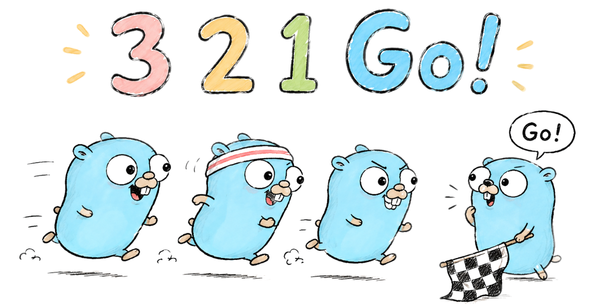
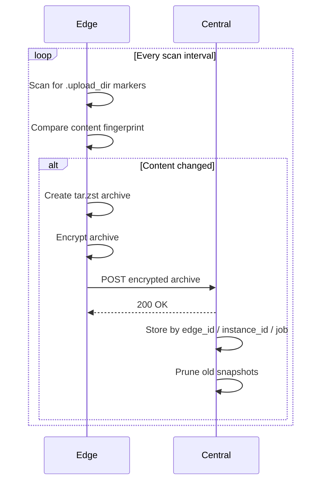

# 3to1go

<p align="center">
  <br>
  <sup>Go Gopher artwork <a href="#attr-1">[1]</a></sup>
</p>

The name works on three levels: it references the [3-2-1 backup rule](https://en.wikipedia.org/wiki/Backup#Storage)<sup><a href="#attr-2">[2]</a></sup> (keep **3** copies, on **2** different media, with **1** offsite), it reads as a countdown — 3, 2, 1, Go! — and the "Go" is the literal language [Go](https://go.dev/)<sup><a href="#attr-3">[3]</a></sup>.

3to1go is a simple backup system with two parts:

- `Edge` runs on the machine that has the files you care about.
- `Central` receives encrypted backups and keeps them on disk.

If you want the shortest mental model:

1. Pick a machine to run Central.
2. Run Edge on each machine you want to back up.
3. Mark folders on Edge with a `.upload_dir` file.
4. Edge packs and encrypts those folders.
5. Central stores the snapshots and lets you browse them in a web UI.

## Why Use 3to1go

- **Simple Central/Edge model** - Central receives and organizes backups, while each Edge owns scanning, encryption, scheduling, and upload retries.
- **Encrypted snapshots by default** - Edge encrypts archives before upload, so Central can store backups without needing plaintext file access.
- **Instance-aware storage** - Central tracks both `edge_id` and `edge_instance_id`, letting related machines be grouped without mixing their snapshots or pruning each other.
- **Persistent operational state** - Central keeps metadata, users, settings, Edge registrations, minted credentials, and revocations in PostgreSQL; Edge keeps its local settings in its own persisted database.
- **Operator-friendly credentials** - Central mints Edge JWT credentials from the UI, Edge saves the pasted credential locally, and Central can revoke a token without deleting snapshots.

## 3-2-1 In Practice

3to1go covers the first two copies. The third is up to you — and it may already be covered depending on where you put Central.

| Copy | What | Covered by |
|------|------|------------|
| 1 — live data | The original files on your machine | Edge |
| 2 — second copy, different media | Encrypted snapshots on a separate machine | **3to1go: Edge → Central** |
| 3 — offsite | A copy that survives a local disaster | Your choice (see below) |

Central is always your own infrastructure, so it counts as "offsite" only if you run it at a genuinely separate location. Two common approaches:

**Central is already offsite** — run Central on a VPS, a machine at a family member's place, or any host physically separate from your Edge machines. Edge → Central already satisfies copy 3.

**Central is local** — run Central on a home NAS or local server for fast access, then sync Central's `BACKUP_ROOT` elsewhere to get the offsite copy. Because Central stores encrypted archives, you can push that data to any storage you like without exposing plaintext files.

Because Edge encrypts archives before upload, Central never sees your plaintext files. That makes it practical to run Central on hardware you do not fully control, such as a shared home server or an inexpensive remote host.

### Storage Scope

`BACKUP_ROOT` is just a directory path. Central writes plain files there and does not care what is behind it, so you can point it at any mounted filesystem:

- **Local disk** — the default; fast and simple.
- **Mounted NAS** — works out of the box. Central already handles cross-device moves when the backup root is on a different filesystem than the system temp directory.
- **Removable hard drive** — same as above; mount it and point `BACKUP_ROOT` at it.
- **Dropbox / Google Drive / OneDrive** — point `BACKUP_ROOT` at the local sync folder. The desktop client replicates files to the cloud automatically. Because Central stores encrypted archives, the cloud provider never has access to plaintext data.
- **S3 / Backblaze B2 / other object storage** — mount the bucket as a local filesystem first (e.g. with `rclone mount`) and point `BACKUP_ROOT` at the mount point. Alternatively, keep `BACKUP_ROOT` on a local disk and run `rclone sync` or `aws s3 sync` on a schedule to push completed backups to the bucket.

Central is not trying to be a sync engine itself — it just writes files. Any tool that can replicate a directory can handle the rest.

## What It Feels Like To Use

You do not write a giant backup config file up front.

Instead, Edge scans a root folder such as `/home`, `/Users`, or `C:\Users`. Any directory that contains a `.upload_dir` file becomes a backup job. That makes setup feel more like "drop a marker into the folder I want backed up" than "build a big central manifest."

## How The System Works

The full flow looks like this:

1. You create a `.upload_dir` file in a folder on Edge.
2. Edge notices that folder during its scan.
3. Edge fingerprints the files to see whether anything changed.
4. If something changed, Edge creates a `tar.zst` archive.
5. Edge encrypts that archive locally.
6. Edge uploads the encrypted archive to Central.
7. Central verifies the upload, stores it by `edge_id/edge_instance_id/job_name`, and prunes old snapshots per instance.
8. You browse and download snapshots from Central's web UI.



Central never needs your plaintext files in order to store them. Decryption happens in the browser when you download an encrypted snapshot.

## Quick Start

### 1. Start Central

Central is usually the always-on receiver.

- For normal Docker deployment, use [`deploy-example/central/`](deploy-example/central/).
- Use [`central/`](central/) if you are contributing and want to build from this repo.
- Start the container.
- Open the Central UI at `http://localhost:6555/`.
- Mint an Edge credential from the Central UI.

More detail: [`deploy-example/central/`](deploy-example/central/)

### 2. Start Edge

Edge runs on the machine that owns the files.

- For normal Docker deployment, use [`deploy-example/edge/`](deploy-example/edge/).
- Use [`edge/`](edge/) if you are contributing and want to build from this repo.
- Open the local Edge UI at `http://localhost:6556/`.
- Set `CENTRAL_URL`.
- Paste the credential minted by Central.
- Pick a unique `EDGE_ID`.

More detail: [`deploy-example/edge/`](deploy-example/edge/)

### 3. Mark A Folder For Backup

Create a file named `.upload_dir` inside the folder you want to back up.

Example:

```text
/scan/photos/.upload_dir
```

Minimal example:

```yaml
job_name: photos
```

An empty `.upload_dir` also works. In that case, Edge uses the folder name as the job name.

## Important Things To Know

### Internal HTTPS Certificates

The Docker deployments support optional user-provided CA certificates for internal HTTPS services such as `https://ntfy.home`.

Admins can upload `.crt` PEM CA/root certificates from each app's **Edit Settings** dialog under **Trusted Certificates**. The app stores uploaded certificates under `/config/trusted-certs`, installs them into the container trust store immediately, and reinstalls them on later container starts.

For automated deployments, you can also drop CA/root certificates ending in `.crt` into the app's persisted config certificate directory:

```text
deploy-example/central/config/trusted-certs/home-ca.crt
deploy-example/edge/config/trusted-certs/home-ca.crt
```

This keeps user-specific certificates out of the image while allowing Central and Edge to verify private HTTPS endpoints.

### Encryption

Each Edge creates its own `encryption.key` file on first run.

- Edge encrypts archives before upload.
- Central stores encrypted blobs.
- Central's UI can verify the key fingerprint before decrypting a download.
- If you lose `encryption.key`, old encrypted snapshots from that Edge are not recoverable.

Back up that key file.

### Edge Credentials

Edge authenticates to Central with a signed JWT credential minted by Central.

- Central stores credential metadata in its database, not raw tokens.
- Edge stores the pasted credential in its local settings database.
- New credentials are single-instance by default and bind to the first Edge instance that reports in with them.
- Shared credentials can be minted intentionally with an instance limit.
- Central can revoke a credential after at least one Edge instance has reported in with it; otherwise the token expires naturally.

### Reset A Central Admin Password

`INITIAL_ADMIN_PASSWORD` is only used when Central creates the first admin user in an empty database. Changing it later does not reset an existing account. `POSTGRES_PASSWORD` is the database password, not the Central web UI password.

If you are locked out of Central, SSH into the Docker host, change into the Central Compose directory, and reset the admin password in Postgres:

```sh
cd deploy-example/central
docker compose exec postgres psql -U three_to_one_go -d three_to_one_go -c "CREATE EXTENSION IF NOT EXISTS pgcrypto; UPDATE app_users SET password_hash = crypt('admin', gen_salt('bf', 10)), must_change_password = true WHERE username = 'admin';"
```

If you changed `POSTGRES_USER` or `POSTGRES_DB` in `.env`, use those values in place of `three_to_one_go`.

Then open Central and sign in with:

```text
username: admin
password: admin
```

Central will require a new password after sign-in.

### Unique Edge IDs Matter

Each Edge needs its own `EDGE_ID`.

Central groups snapshots by `EDGE_ID`, but newer builds keep each Edge installation isolated underneath that by `edge_instance_id`. That prevents two machines sharing one `EDGE_ID` from silently writing into the same namespace and pruning each other's snapshots.

## Design Decisions

### Full Snapshots

Each backup produces a complete `tar.zst` archive of the marked folder. Incremental backups, block-level deduplication, and delta chains are not supported. Each snapshot is fully self-contained and can be restored independently without reference to any other snapshot.

### Count-Based Retention

Central retains the most recent N snapshots per job, where N is controlled by the `retention_keep_last` setting. Time-based retention windows and size-based limits are not supported. The number of recoverable snapshots at any point is always exactly known.

### Content Fingerprinting, Not File Timestamps

Edge determines whether a new snapshot is needed by comparing the folder's content fingerprint against the previous upload. File modification times (mtime) are not used as a signal, as they can be altered by restores, synchronization tools, and filesystem operations in ways that do not reflect actual content changes. The Force Backup option is available to bypass fingerprint comparison and upload unconditionally.

## Repo Layout

- [`deploy-example/central/`](deploy-example/central/) - user-facing Central Compose setup with the published image
- [`deploy-example/edge/`](deploy-example/edge/) - user-facing Edge Compose setup with the published image
- [`central/`](central/) - 3to1go Central: receiver API, storage logic, and web UI (Go<sup><a href="#attr-3">[3]</a></sup>)
- [`edge/`](edge/) - 3to1go Edge: scan agent, upload logic, encryption, and web UI (Go<sup><a href="#attr-3">[3]</a></sup>)

## Author

Created by [thesteau](https://github.com/thesteau).

## Support

If this project is useful to you, consider buying me a coffee — it keeps the project going.

[](https://buymeacoffee.com/thesteau)

## Attribution

<a id="attr-1"></a>**[1] Go Gopher artwork** — The Go Gopher mascot was designed by [Renée French](https://reneefrench.blogspot.com/) and is licensed under the [Creative Commons Attribution 4.0 License (CC BY 4.0)](https://creativecommons.org/licenses/by/4.0/). The "3, 2, 1, Go!" racing artwork used in this project is a derivative of that original character created by the Go community.

<a id="attr-2"></a>**[2] 3-2-1 backup rule** — The backup strategy referenced by this project's name is a widely documented industry practice. See the [Wikipedia article on backup storage](https://en.wikipedia.org/wiki/Backup#Storage) for background.

<a id="attr-3"></a>**[3] Go programming language** — This project is written in [Go](https://go.dev/). Go and the Go logo are trademarks of Google LLC. This project is not affiliated with, endorsed by, or sponsored by Google or the Go team.

## Disclaimers

3to1go is provided as-is for personal and home lab use. It is not a substitute for a comprehensive disaster recovery plan. You are responsible for:

- Verifying that your backups are complete and recoverable.
- Securing the machine running Central and the network path between Edge and Central.
- Keeping your `encryption.key` safe — losing it means losing access to encrypted snapshots permanently.
- Complying with any applicable laws or regulations regarding the storage of your data.

## License

This project is licensed under the MIT License. See [`LICENSE`](LICENSE) for the full text, including the "as is" warranty and liability disclaimer.
