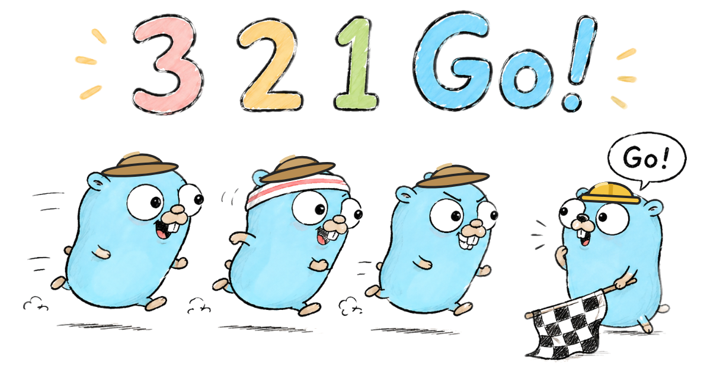
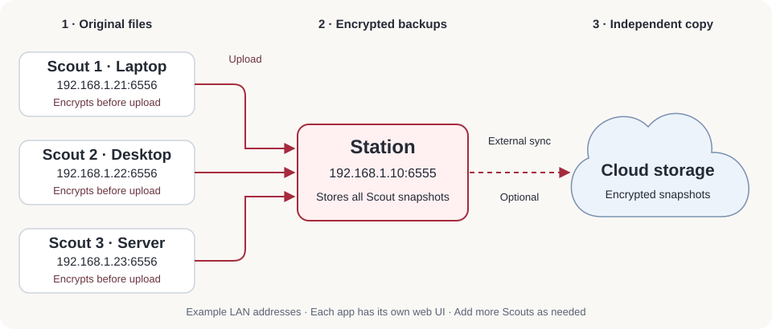

# 3to1go

<p align="center">
  <br>
  <sup>Go Gopher artwork <a href="#attr-1">[1]</a></sup>
</p>

The name works on three levels: it references the [3-2-1 backup rule](https://en.wikipedia.org/wiki/Backup#Storage)<sup><a href="#attr-2">[2]</a></sup> (keep **3** copies, on **2** different media, with **1** offsite), it reads as a countdown (3, 2, 1, Go!), and it's written in [Go](https://go.dev/)<sup><a href="#attr-3">[3]</a></sup>.

3to1go is a simple backup system with two parts:

- `Scout` runs on the machine that has the files you care about.
- `Station` receives encrypted backups and keeps them on disk.

Like the gophers racing above, each Scout heads out on one of your machines, gathers the folders you chose, seals them, and carries them back to the Station. The Station keeps every pack safe but never opens one, because only the Scout has the key. When you need your files back, the Scout fetches a pack from the Station and unpacks it at home.

If you want the shortest mental model:

1. Pick a machine to run Station.
2. Run Scout on each machine you want to back up.
3. Choose folders in Scout's UI. Each is saved as a `.upload_dir` file, which you can also edit directly.
4. Scout packs and encrypts those folders.
5. Station stores the snapshots and lets you browse them in a web UI.

**[Documentation](https://3to1go.docs.thesteau.com/) · [Quickstart](https://3to1go.docs.thesteau.com/quickstart) · [How it works](https://3to1go.docs.thesteau.com/concepts/how-it-works)**



Each Scout has its own address and web UI on port **6556**. They all upload to Station on port **6555**. Station never sees plaintext files, and an external sync tool can copy its encrypted snapshots to independent storage for a third copy.

## Why Use 3to1go

- **Choose folders directly.** Create backup jobs in Scout's UI. Each job is a `.upload_dir` file in its folder, which you can also write or edit yourself.
- **Encrypt before upload.** Station only stores encrypted archives. Downloads are decrypted in your browser, and restores on Scout itself.
- **Keep machines separate.** Each installation has its own instance ID and snapshot history, even when Scout IDs are shared.
- **Automate backups.** Schedule cycles, resume interrupted uploads, configure retention, and connect hooks or ntfy notifications.
- **Control access.** Mint and revoke Scout credentials from Station's UI.

## Get Started

You need Docker with Compose on the machines running Station and Scout.

### 1. Deploy Station

On the machine that will store backups, download the published-image Compose setup:

```sh
mkdir 3to1go-central && cd 3to1go-central
curl -fsSLO https://raw.githubusercontent.com/thesteau/3to1go/main/deploy-example/central/docker-compose.yml
curl -fsSL https://raw.githubusercontent.com/thesteau/3to1go/main/deploy-example/central/.env.example -o .env
```

Edit `.env`: set a real `POSTGRES_PASSWORD`, choose `BACKUP_DIR` for snapshot storage, and optionally set `INITIAL_ADMIN_PASSWORD`. Then start Station and its database:

```sh
docker compose up -d
```

Open `http://<central-host>:6555/`. Sign in as `admin` with your initial password (default `admin`) and choose a new password when prompted. Click **Mint Edge Credential** and copy the token for Scout.

### 2. Deploy Scout

On each machine with files to back up:

```sh
mkdir 3to1go-edge && cd 3to1go-edge
curl -fsSLO https://raw.githubusercontent.com/thesteau/3to1go/main/deploy-example/edge/docker-compose.yml
curl -fsSL https://raw.githubusercontent.com/thesteau/3to1go/main/deploy-example/edge/.env.example -o .env
```

Edit `.env` with your own values:

```dotenv
EDGE_ID=laptop-alice
CENTRAL_URL=http://192.168.1.10:6555
SCAN_DIR=/home/alice
```

`SCAN_DIR` is the host folder mounted at `/scan` inside Scout. Use a distinct `EDGE_ID` for each machine. `CENTRAL_URL` must be reachable from inside Scout's container. On the same Docker Desktop host, it's usually `http://host.docker.internal:6555`. Use HTTPS for both web UIs and Station's URL when the network is untrusted.

```sh
docker compose up -d
```

Open `http://<edge-host>:6556/`, sign in as `admin`, and change the initial password. In **Edit Edge Settings**, paste the token into **Edge Credential** and save. Save a copy of the **Encryption Key** somewhere off this machine.

### 3. Choose a folder and back it up

In Scout's folder browser, click **Edit** on a folder and **Save Job**. Scout saves the job as a `.upload_dir` file in the folder. Creating or editing that file yourself does the same thing. An empty file uses the folder name as the job name.

Click **Run Backup Cycle Now** to back up immediately. Station keeps the most recent snapshots per job and Scout instance (three by default).

Backups run weekly by default. Change the cron schedule in Scout's settings. Browse snapshots in Station, or use **Restore** on a Scout job to preview and recover its files.

For more detail, see the [quickstart](https://3to1go.docs.thesteau.com/quickstart), [Station installation](https://3to1go.docs.thesteau.com/station/install), and [Scout installation](https://3to1go.docs.thesteau.com/scout/install). To update either deployment, run `docker compose pull` followed by `docker compose up -d` in its Compose folder.

## Before You Rely on It

- **Keep your encryption key safe.** Losing it means losing access to the snapshots it encrypted. Practice a [restore](https://3to1go.docs.thesteau.com/scout/restore).
- **Backups are full snapshots.** Change detection uses sorted file paths and sizes. Same-size edits need **Force Upload**. Clear an older staged backup first so Force Upload builds a fresh archive.
- **Restore replaces matching files.** Local files absent from the snapshot stay untouched. Review the preview before confirming.
- **Plan a third copy.** Your original files and Station's snapshots are two copies, even when Station is offsite. See [Storage and the 3-2-1 rule](https://3to1go.docs.thesteau.com/concepts/storage-and-3-2-1).

See [Design decisions](https://3to1go.docs.thesteau.com/concepts/design-decisions) for retention, permissions, and other intentional behavior.

## Guides

| Task | Documentation |
|---|---|
| Back up several folders or drives | [Multiple folders and drives](https://3to1go.docs.thesteau.com/scout/multiple-folders) |
| Configure the apps | [Station](https://3to1go.docs.thesteau.com/station/configuration) · [Scout](https://3to1go.docs.thesteau.com/scout/configuration) |
| Browse, download, or verify backups | [Snapshots](https://3to1go.docs.thesteau.com/station/snapshots) |
| Back up and recover Station itself | [Recover Station](https://3to1go.docs.thesteau.com/station/disaster-recovery) |
| Manage sign-in or recover access | [Accounts](https://3to1go.docs.thesteau.com/shared/sign-in) · [Reset Station's password](https://3to1go.docs.thesteau.com/station/reset-admin-password) |
| Trust internal HTTPS services | [Trusted certificates](https://3to1go.docs.thesteau.com/shared/trusted-certificates) |


## Author

Created by [thesteau](https://github.com/thesteau).

## Support

If this project is useful to you, consider buying me a coffee. It keeps the project going.

[](https://buymeacoffee.com/thesteau)

## Attribution

<a id="attr-1"></a>**[1] Go Gopher artwork.** The Go Gopher mascot was designed by [Renée French](https://reneefrench.blogspot.com/) and is licensed under the [Creative Commons Attribution 4.0 License (CC BY 4.0)](https://creativecommons.org/licenses/by/4.0/). The "3, 2, 1, Go!" racing artwork used in this project is a derivative of that original character created by the Go community.

<a id="attr-2"></a>**[2] 3-2-1 backup rule.** The backup strategy referenced by this project's name is a widely documented industry practice. See the [Wikipedia article on backup storage](https://en.wikipedia.org/wiki/Backup#Storage) for background.

<a id="attr-3"></a>**[3] Go programming language.** This project is written in [Go](https://go.dev/). Go and the Go logo are trademarks of Google LLC. This project is not affiliated with, endorsed by, or sponsored by Google or the Go team.

## Disclaimers

3to1go is provided as-is for personal and home lab use. It is not a substitute for a comprehensive disaster recovery plan. You are responsible for:

- Verifying that your backups are complete and recoverable.
- Securing the machine running Station and the network path between Scout and Station.
- Keeping your `encryption.key` safe. Losing it means losing access to encrypted snapshots permanently.
- Complying with any applicable laws or regulations regarding the storage of your data.

## License

This project is licensed under the MIT License. See [`LICENSE`](LICENSE) for the full text, including the "as is" warranty and liability disclaimer.
