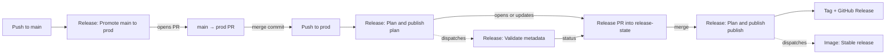

# Releasing

Maintainer notes for the release pipeline. The contributor-facing overview is in [docs/releases.mdx](docs/releases.mdx).

## Workflows

| Workflow | File | Trigger | Does |
|---|---|---|---|
| Release: Promote main to prod | `release-promote.yml` | Push to `main` | Opens or updates the single `main` → `prod` PR |
| Release: Plan and publish | `release-please.yml` | Push to `prod`, merge into `release-state`, manual | `plan`: opens or updates the release PR. `publish`: tags the approved prod SHA and creates the GitHub Release |
| Image: Stable release | `stable-docker-images.yml` | Dispatched by Release: Plan and publish, manual | Builds `vX.Y.Z` images from a published release tag. Skips tags that already exist |
| Release: Validate metadata | `release-state-check.yml` | Release PRs | Posts the `Validate release metadata` status required on `release-state` |



Release Please (pinned in `package.json`) runs through `scripts/release-state.cts` instead of the standard action, which can't tag a branch other than the one holding its metadata. `release-please-config.json` uses the `go` strategy, unprefixed `vX.Y.Z` tags, and `initial-version: 1.0.0`.

Events from the built-in `GITHUB_TOKEN` don't trigger other workflows, so the release workflow dispatches validation and image builds explicitly. Checks on automation-created PRs may show **Approve workflows to run**.

### Workflow names

Display names start with the workflow's purpose, and file names use the matching prefix:

| Prefix | Purpose | Workflows |
|---|---|---|
| `CI:` / `ci-` | Checks on every PR and branch push. End-to-end only runs on pushes to `main` and `prod`. | Go tests, Frontend, End-to-end |
| `PR:` / `pr-` | PR policy | Conventional Commit title, Production source |
| `Image:` / `image-` | Docker image publishing. The `latest` images publish after End-to-end passes on a `main` push. | Station latest, Scout latest, Stable release |
| `Release:` / `release-` | Release pipeline | Promote main to prod, Plan and publish, Validate metadata |

`stable-docker-images.yml` keeps its old file name because `release-please.yml` starts it by name on `prod`. Renaming it means changing both files, and both changes must reach `prod` together. Required checks match **job** names, so renaming a workflow is usually safe, but renaming a required job needs a ruleset update. The exception is "CI: End-to-end": both `latest` image workflows wait for it by that display name, so renaming it would stop `latest` images from publishing.

## Repository settings

**Settings → General → Pull Requests**
- Allow merge commits and squash merging. The rulesets below limit each branch to one method:

  | Into | Method | Why |
  |---|---|---|
  | `main` | Squash | The PR title becomes the commit Release Please reads |
  | `prod` | Merge commit | Keeps every promoted commit. A squash would release nothing |
  | `release-state` | Merge commit | One `Merge pull request #N` per approved release |

- Set the squash commit message default to **Pull request title**.
- Turn off automatic head-branch deletion, because `main` is the promotion PR's head.

**Settings → Actions → General**
- Enable **Allow GitHub Actions to create and approve pull requests**.

**Settings → Actions → Policies**
- Allow `pull_request_target` and `workflow_dispatch` for `release-please.yml` and `release-state-check.yml`.
- Allow `push` for `release-please.yml`.

**Settings → Rules → Rulesets**

| Target | Rules |
|---|---|
| `main` | PR, 1 approval, dismiss stale approvals, resolve conversations, no force push or deletion. Merge method: **Squash**. Checks: `Run station unit tests`, `Run scout unit tests`, `Type-check, compile and run UI tests`, `Validate Conventional Commit PR title`. Don't require `Scout to Station backup and recovery`: it only runs after a push to `main` or `prod`, so a PR would wait for it forever |
| `prod` | Same as `main`, without the title check, plus `Validate production PR source` and `Scout to Station backup and recovery`. The promotion PR's head is `main`'s latest commit, which already ran the end-to-end test on push, so requiring it adds no runs and blocks promoting a commit that failed it. Merge method: **Merge**. Don't require up-to-date branches or linear history. `prod` is never merged back into `main`, so every later promotion PR would be out of date |
| `release-state` | PR, 1 approval, dismiss stale approvals, resolve conversations, no force push or deletion. Merge method: **Merge**. Require up-to-date branches, so a PR built on older metadata can't be approved. Check: `Validate release metadata` (the commit status, not `Run release metadata validation`) |
| Tags `v*` | Restrict creation, update, and deletion, but let the release workflow create tags. Enable immutable releases if available |

Leave `release-please--branches--release-state` unprotected, because Release Please force-pushes it.

## Bootstrapping

1. Create `prod` from `main`.
2. Apply the settings above.
3. Run **Release: Plan and publish** on `prod` with `plan`. This creates the orphan `release-state` branch and the first `1.0.0` release PR. `prod` needs at least one `feat`, `fix`, `perf`, `revert`, or `!` commit for this to work.
4. Protect `release-state`, then review and merge the release PR.

## Failed publishes

- **Tag or GitHub Release missing:** run **Release: Plan and publish** on `prod` with `publish`. It completes the approved release without moving existing tags.
- **Image missing:** run **Image: Stable release** on `prod` with the release tag. Images that already exist are skipped.

Never move or reuse a version tag.

## When prod is reset

`prod` is restored from time to time. A promotion's merge commit only exists on `prod`, so a release tags the `main` commit the promotion brought in instead. It has the same files and stays in `prod`'s history when `prod` is reset to `main`. If `prod` has changes of its own, the merge commit is tagged.

If a reset still drops the last release's commit, planning doesn't need it in `prod`'s history. Tags keep released commits, and the next release counts only the commits on `prod` that no earlier release tag includes. The workflow log notes when the last release's commit isn't in `prod`'s history.

A reset that keeps commit IDs, such as resetting `prod` to `main`, counts nothing twice. Commits re-created with new IDs, by a rebase or squash, count again. Check the release PR's version and notes before approving it.

## Recovering `release-state`

The branch is an orphan containing exactly three files:

- `.release-please-manifest.json`, for example `{".": "1.0.0"}`
- `CHANGELOG.md`
- `release.json`, which records `version`, `tag`, `prodSha`, `previousTag`, `previousSha`, and `notes`. It is `null` before the first release.

If the branch is deleted:

1. Disable **Release: Plan and publish** first. Running `plan` against an empty branch would propose `v1.0.0` again.
2. Find the last approved state. Use the `merge_commit_sha` of the most recently merged release PR, or a local clone that still has it. Don't use a version tag, because tags point at prod code.
3. Recreate the branch without overwriting anything:
   ```sh
   git push --force-with-lease=refs/heads/release-state: origin <SHA>:refs/heads/release-state
   ```
4. Reapply the ruleset, then re-enable the workflow. Run `publish` if that release was never published. Otherwise run `plan`.

If the commit is gone, rebuild the three files by hand on an orphan branch and push them the same way. First, check whether the most recently merged release PR has a published GitHub Release:

- **Not published:** that approval is still outstanding. Rebuild from the PR's **Files changed** tab, which shows the approved `release.json` and manifest, then run `publish` in step 4. If you rebuild from the latest published release instead, the approval is silently dropped.
- **Published:** rebuild from that GitHub Release. Use its tag, its commit SHA, its notes, and the previous release's tag and SHA. Then run `plan`.
