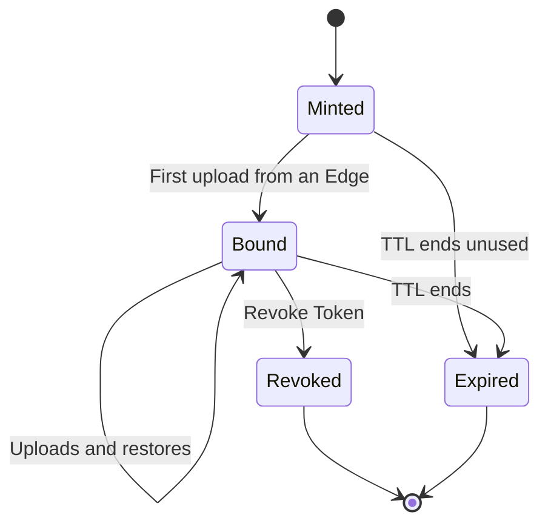

Edges authenticate to Central with a signed credential that Central mints. Central keeps a record of each credential but never stores the raw token.

## Mint a credential

<Steps>
  <Step title="Open the dialog">
    In Central, click **Mint Edge Credential**.
  </Step>
  <Step title="Choose options">
    - **TTL Days**: how long the credential is valid, from 1 to 3650 days (default 365).
    - **Shared credential**: leave off for one Edge. See [Shared credentials](#shared-credentials).
  </Step>
  <Step title="Mint and copy">
    Click **Mint Credential**, then **Copy**.
  </Step>
  <Step title="Paste it into Edge">
    In Edge, open **Edit Edge Settings** and paste it into **Edge Credential**, then save.
  </Step>
</Steps>

<Warning>
  The credential is shown **once**. Paste it into Edge before closing the dialog. If you lose it, mint another.
</Warning>

## How binding works

A normal credential is **single-instance**: it binds to the first Edge installation that uploads with it, and Central rejects it from any other installation.

## Shared credentials

To use one credential on several machines, turn on **Shared credential** and set **Shared Instance Limit** to the number of Edge installations allowed to use it (2 to 10000).

Each machine still gets its own instance ID, so their snapshots stay separate on Central.

## Revoke a credential

Click **Revoke Token** on the Edge instance in Central's snapshot view. That Edge can no longer upload or restore. Snapshots already stored are **kept**, and you can still download them from Central's UI. Revoking a shared credential stops **every** Edge using it.

<Note>
  A credential can only be revoked after an Edge has reported in with it. An unused credential just expires at the end of its TTL.
</Note>

## Replace a credential

Revoke the old credential first, because Central rejects a new one while the instance is still bound to the old one. The replacement binds on Edge's next upload, not when you save it.

## Delete an Edge instance

**Delete Instance** permanently deletes **all snapshots** for that instance and removes it from Central, along with the archive size history used for [unusual sizes](/central/snapshots#unusual-sizes). It can't be undone. If Central finds no backup files for an instance, it offers to remove the stale entry instead.

Deleting an instance doesn't revoke its credential. Stop the Edge or revoke the credential first if it must stop uploading.
