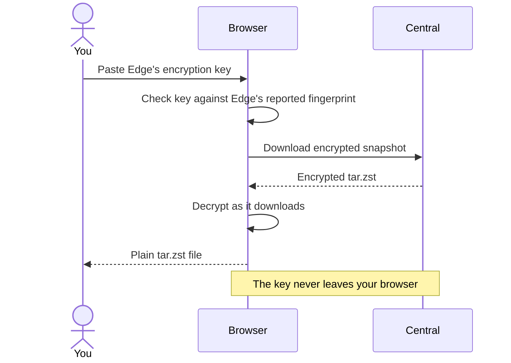

Central's main page, **Stored Snapshots**, lists every Edge, each of its instances, their jobs, and each job's snapshots. The newest snapshot of each job is tagged **latest**.

<Frame caption="An expanded Edge instance with a stored snapshot in a local demo deployment.">
  
</Frame>

## How snapshots are stored

Each snapshot is one encrypted `tar.zst` file in Central's backup folder:

```text
/backups/<edge_id>/<edge_instance_id>/<job_name>/<job>__<timestamp>__<fingerprint>.tar.zst
```

The fingerprint in the filename is the first eight characters of Edge's path-and-size fingerprint. You can use it to [restore a matching snapshot](/edge/restore#restore-a-specific-snapshot) from Edge, but multiple snapshots can share it.

## Download a snapshot

Click **Download** on a snapshot. The first time, Central asks for that Edge's **encryption key**.



<Note>
  Your browser does the decrypting, so open Central over HTTPS or through `localhost`. A plain HTTP address on your network won't work.
</Note>

<Steps>
  <Step title="Copy the key from Edge">
    In Edge's UI, find **Encryption Key** and click **Copy**. See [Encryption key](/edge/encryption-key).
  </Step>
  <Step title="Paste it into Central">
    Paste it when Central prompts. Central checks it against the key fingerprint that Edge reported, so a wrong key is caught before decryption starts.
  </Step>
  <Step title="Save the file">
    The snapshot is decrypted in your browser as it downloads, and saved as a regular `tar.zst` archive.
  </Step>
</Steps>

The key stays in that browser tab and is never sent to Central's server. **Clear** removes it. Signing out, an expired session, or closing the tab clears every saved key.

To extract the downloaded archive:

```sh
tar --zstd -xf photos__2026-09-30T02-00-00Z__abcdef12.tar.zst
```

<Tip>
  To put files back on the original machine, [restore from Edge](/edge/restore) instead. It downloads, decrypts, and extracts for you.
</Tip>

## Delete a snapshot

Click **Delete** on a snapshot and confirm. This permanently removes the file.

## Retention

After each upload, Central keeps the most recent snapshots for that job **and Edge instance** and deletes older ones. **Keep Last Snapshots** in **Edit Central Settings** sets how many (default `3`). Edge instances never prune each other's snapshots, even if they share an `EDGE_ID`.

Age is judged by each file's modification time, so keep those times when copying archives back into the backup folder.

## Unusual sizes

Central remembers the size of each job's last 20 uploads. When a new archive is less than half or more than double the job's usual size, and far outside its normal range, the snapshot gets an **unusual size** badge. Hover over it to see why, for example:

> This archive is 39.1 KB, but this job's archives are usually about 979.0 KB.

Central also sends an [ntfy alert](/central/notifications#unusual-size-alerts) and passes the reason to the [post hook](/central/hooks). The check needs 5 earlier uploads and can be turned off with **Unusual uploads** in **Edit Central Settings**.

Central only sees archive sizes, and by the time an archive arrives it has already left Edge, so it can flag but not hold. Edge's own checks are stronger and can hold a backup before it uploads. See [Unusual backups](/edge/unusual-backups).

## Integrity checks

Central can re-check stored snapshots with SHA-256 to catch files corrupted or changed on disk. Each check covers the **latest snapshot of every job**, not the full history.

- **Run Now**: start a check from the integrity bar on the snapshots page.
- **Scheduled**: set **Snapshot Integrity Check Interval** (hours) in **Edit Central Settings**. `0` turns scheduled checks off.

<Note>
  Central reads the check interval when it starts. After changing it, restart Central: `docker compose restart central`.
</Note>

The bar shows the latest result and when it ran. Results reset when Central restarts. Snapshots without a recorded checksum are skipped. A passing check confirms the stored bytes are intact, not that you still have the key to decrypt them.
