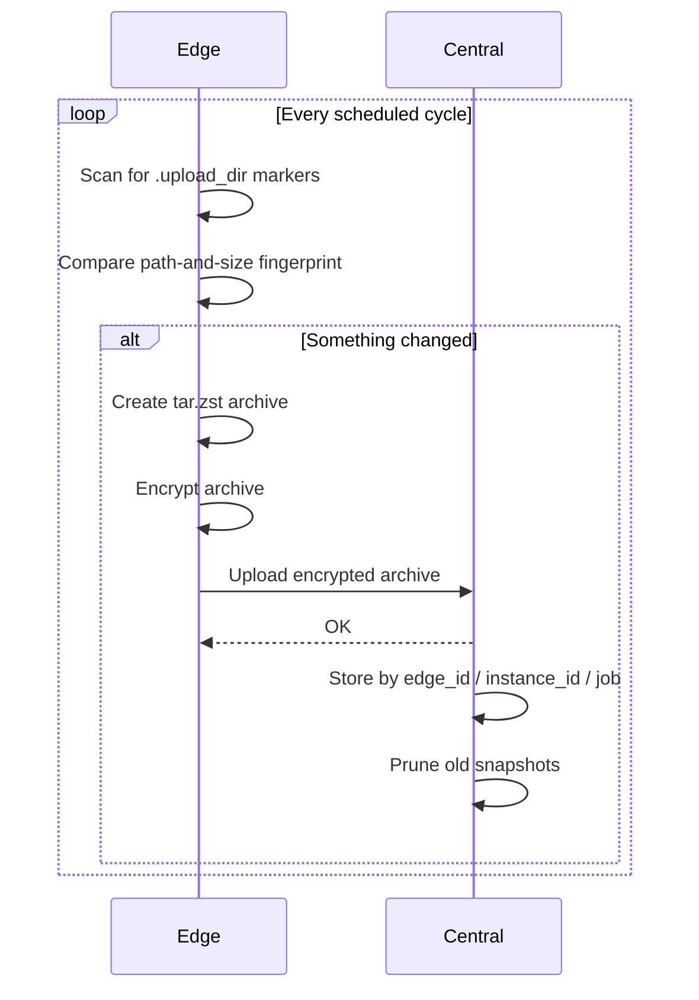

Edge does all the work that needs your plaintext files. Central only receives encrypted archives.

<Frame caption="Each Edge uploads to the same Central. The cloud copy is made by an external tool.">
  
</Frame>

The addresses are examples. Each Edge sets its **Central URL** to the same Central, here `http://192.168.1.10:6555`. The numbers count copies of each machine's data. Central doesn't make the third copy itself. See [Storage and the 3-2-1 rule](/concepts/storage-and-3-2-1).

| | Edge | Central |
|---|---|---|
| Runs on | Each machine with files to back up | One always-on host |
| Default UI | `http://localhost:6556/` | `http://localhost:6555/` |
| Owns | Scanning, fingerprinting, archiving, encryption, scheduling, upload retries, restore | Receiving uploads, storage, retention, credentials, integrity checks, snapshot browsing |
| Stores its settings in | A local SQLite database | PostgreSQL |
| Sees plaintext files | Yes | No |

## The backup flow

<Steps>
  <Step title="You mark a folder">
    Create a `.upload_dir` file in a folder on the Edge machine, or select the folder in Edge's UI.
  </Step>
  <Step title="Edge finds it during a scan">
    On each scheduled cycle, Edge walks its scan root looking for markers. Each marked folder is a **job**.
  </Step>
  <Step title="Edge decides whether anything changed">
    Edge fingerprints the job's sorted file paths and sizes and compares that with the last backup. See [Design decisions](/concepts/design-decisions#path-and-size-fingerprinting).
  </Step>
  <Step title="Edge builds and encrypts an archive">
    If the fingerprint changed, Edge creates a `tar.zst` archive of the folder and encrypts it with its own key.
  </Step>
  <Step title="Edge uploads it to Central">
    The encrypted archive is uploaded in chunks, with retries and a circuit breaker if Central is unreachable.
  </Step>
  <Step title="Central verifies and stores it">
    Central checks the upload, stores it under `edge_id/edge_instance_id/job_name`, and prunes older snapshots for that instance.
  </Step>
  <Step title="You browse, download, or restore">
    Download snapshots from Central's UI (decrypted in your browser) or restore them from Edge.
  </Step>
</Steps>

## Edge ID and instance ID

- **`EDGE_ID`** is a name you choose, such as `laptop-alice`. Central's UI groups snapshots by it, so give each Edge its own.
- **Instance ID** is generated on first run and saved in Edge's config folder. It keeps installations separate even if two share an `EDGE_ID`, so they never overwrite or prune each other's snapshots.

## Where encryption happens

Each Edge generates its own `encryption.key` on first run and encrypts every archive before upload. Central stores them as-is.

When you download a snapshot in Central's UI, your browser asks for that Edge's key, checks it against the fingerprint Edge reported, and decrypts the file locally. The key is never sent to Central's server. See [Encryption key](/edge/encryption-key).
