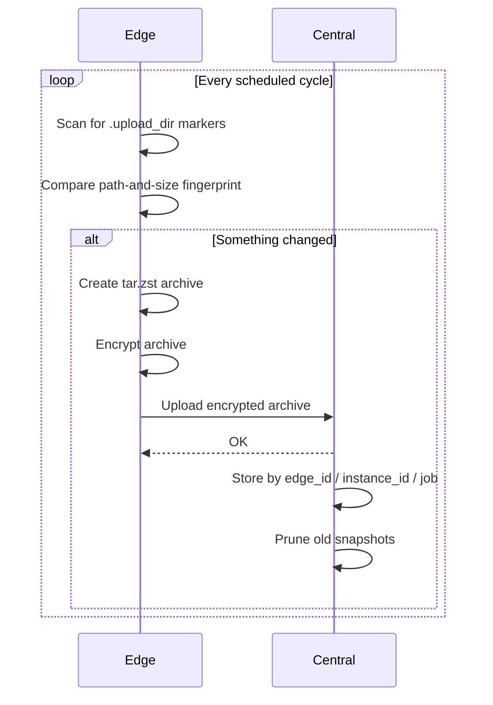

Edge and Central are separate apps with separate jobs. Edge does all the work that needs your plaintext files. Central only ever receives encrypted archives.

| | Edge | Central |
|---|---|---|
| Runs on | Each machine with files to back up | One always-on host |
| Default UI | `http://localhost:6556/` | `http://localhost:6555/` |
| Owns | Scanning, fingerprinting, archiving, encryption, scheduling, upload retries, restore | Receiving uploads, storage, retention, credentials, integrity checks, snapshot browsing |
| Stores its settings in | A local SQLite database | PostgreSQL |
| Sees plaintext files | Yes | No |

## The backup flow

<Steps>
  <Step title="You mark a folder">
    Create a `.upload_dir` file in a folder on the Edge machine, or select the folder in Edge's UI.
  </Step>
  <Step title="Edge finds it during a scan">
    On each scheduled cycle, Edge walks its scan root looking for markers. Each marked folder is a **job**.
  </Step>
  <Step title="Edge decides whether anything changed">
    Edge fingerprints the job's sorted file paths and sizes and compares that with the last backup. See [Design decisions](/concepts/design-decisions#path-and-size-fingerprinting).
  </Step>
  <Step title="Edge builds and encrypts an archive">
    If the fingerprint changed, Edge creates a `tar.zst` archive of the folder and encrypts it with its own key.
  </Step>
  <Step title="Edge uploads it to Central">
    The encrypted archive is uploaded in chunks, with retries and a circuit breaker if Central is unreachable.
  </Step>
  <Step title="Central verifies and stores it">
    Central checks the upload, stores it under `edge_id/edge_instance_id/job_name`, and prunes older snapshots for that instance.
  </Step>
  <Step title="You browse, download, or restore">
    Download snapshots from Central's UI (decrypted in your browser) or restore them from Edge.
  </Step>
</Steps>

## Identity: edge ID and instance ID

Every Edge has two identifiers:

- **`EDGE_ID`** is a name you choose, such as `laptop-alice`. Central groups snapshots by it.
- **Instance ID** is generated automatically on first run and saved in Edge's config directory. It keeps each installation separate, even if two machines were given the same `EDGE_ID` by mistake.

Central stores snapshots under both, so two installations never write into the same place or prune each other's snapshots.

<Tip>
  Still give every Edge its own `EDGE_ID`. It is the name you'll see in Central's UI.
</Tip>

## Where encryption happens

Each Edge generates its own `encryption.key` on first run and encrypts every archive before upload. Central stores the encrypted blobs as-is.

When you download a snapshot from Central's UI, the browser asks for that Edge's key and decrypts the file locally. Central compares the key's fingerprint with the one Edge reported, so it can tell you if you pasted the wrong key before trying to decrypt.

See [Encryption key](/edge/encryption-key) for how to find, back up, and rotate the key.
