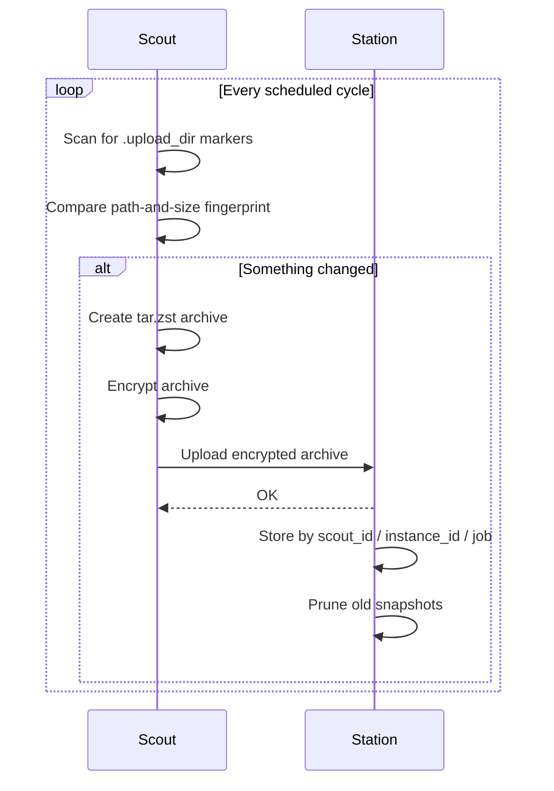

Scout does all the work that needs your plaintext files. Station only receives encrypted archives. Scout gathers and seals each pack, and Station stores packs without opening them.

<Frame caption="Each Scout uploads to the same Station. The cloud copy is made by an external tool.">
  
</Frame>

The addresses are examples. Each Scout sets its **Station URL** to the same Station, here `http://192.168.1.10:6555`. The numbers count copies of each machine's data. Station doesn't make the third copy itself. See [Storage and the 3-2-1 rule](/concepts/storage-and-3-2-1).

| | Scout | Station |
|---|---|---|
| Runs on | Each machine with files to back up | One always-on host |
| Default UI | `http://localhost:6556/` | `http://localhost:6555/` |
| Owns | Scanning, fingerprinting, archiving, encryption, scheduling, upload retries, restore | Receiving uploads, storage, retention, Station tokens, integrity checks, snapshot browsing |
| Stores its settings in | A local SQLite database | PostgreSQL |
| Sees plaintext files | Yes | No |

## The backup flow

<Steps>
  <Step title="You choose a folder">
    Save the folder as a job in Scout's UI. Scout stores it as a `.upload_dir` file in the folder, and creating or editing that file yourself does the same.
  </Step>
  <Step title="Scout finds it during a scan">
    On each scheduled cycle, Scout walks its scan root looking for markers. Each marked folder is a **job**.
  </Step>
  <Step title="Scout decides whether anything changed">
    Scout fingerprints the job's sorted file paths and sizes and compares that with the last backup. See [Design decisions](/concepts/design-decisions#path-and-size-fingerprinting).
  </Step>
  <Step title="Scout builds and encrypts an archive">
    If the fingerprint changed, Scout creates a `tar.zst` archive of the folder and encrypts it with its own key.
  </Step>
  <Step title="Scout uploads it to Station">
    The encrypted archive is uploaded in chunks, with retries and a circuit breaker if Station is unreachable.
  </Step>
  <Step title="Station verifies and stores it">
    Station checks the upload, stores it under `scout_id/scout_instance_id/job_name`, and prunes older snapshots for that instance.
  </Step>
  <Step title="You browse, download, or restore">
    Download snapshots from Station's UI (decrypted in your browser) or restore them from Scout.
  </Step>
</Steps>

## Scout ID and instance ID

- **`SCOUT_ID`** is a name you choose, such as `laptop-alice`. Station's UI groups snapshots by it, so give each Scout its own.
- **Instance ID** is generated on first run and saved in Scout's config folder. It keeps installations separate even if two share a `SCOUT_ID`, so they never overwrite or prune each other's snapshots.

## Where encryption happens

Each Scout generates its own `encryption.key` on first run and encrypts every archive before upload. Station stores them as-is.

When you download a snapshot in Station's UI, your browser asks for that Scout's key, checks it against the fingerprint Scout reported, and decrypts the file locally. The key is never sent to Station's server. See [Scout key](/scout/scout-key).
