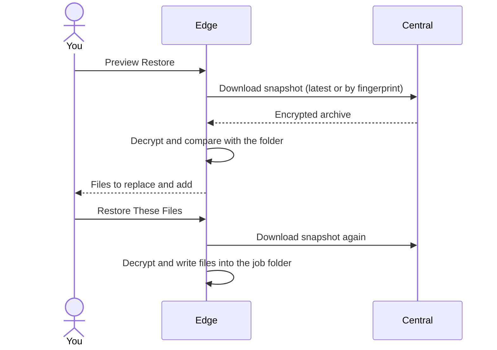

Edge can download a snapshot from Central, decrypt it with its own key, and extract it back into the job's folder.



<Warning>
  Restore **overwrites** local files that are also in the snapshot. Files that aren't in the snapshot are left untouched. Check the preview before confirming.
</Warning>

## Restore the latest snapshot

<Steps>
  <Step title="Open Restore">
    On the job in **Selected Jobs**, click **Restore**.
  </Step>
  <Step title="Leave the fingerprint empty">
    An empty **Snapshot fingerprint** means the latest snapshot.
  </Step>
  <Step title="Preview">
    Click **Preview Restore**. Edge shows how many files the snapshot has, and how many would replace existing files or be added.
  </Step>
  <Step title="Confirm">
    Click **Restore These Files** to write the files into the job's folder. Search and the **All**, **Replace**, and **Add** filters only change what the preview shows. They don't pick a subset to restore.
  </Step>
</Steps>

<Frame caption="Restore preview showing one missing file to add and one local file to replace.">
  
</Frame>

## Restore a specific snapshot

Each snapshot's fingerprint is part of its filename on Central, and is shown as **FP** next to each snapshot in Central's UI:

```text
photos__2026-09-30T02-00-00Z__abcdef12.tar.zst
                              ^^^^^^^^ fingerprint
```

Enter those eight characters (or the full 64-character fingerprint) in **Snapshot fingerprint**, then preview and confirm as above.

Forced backups can share a fingerprint. When several snapshots match, Edge restores the newest. To get an older one, use its **Download** button in Central instead.

A job can only restore its **own** snapshots. You can't restore one job's snapshot into another job's folder.

## Requirements

- Edge must be able to reach Central, with a valid credential.
- Edge must have the **same encryption key** that encrypted the snapshot. If it doesn't, the restore fails with "unable to decrypt snapshot with this Edge key".

<Note>
  After you [rotate the key](/edge/encryption-key#rotate-the-key), Edge can no longer restore snapshots made with the old key, and Central's UI stops accepting the old key after Edge's next upload. Download any older snapshots you need **before** rotating.
</Note>

## Rebuilding a lost machine

Edge only restores snapshots belonging to its own **instance ID**, which is stored in `config/installation.id`. A fresh install gets a new instance ID, so it can't restore the old machine's snapshots through Edge on its own.

**If you have the old Edge's whole `config` folder** (it includes `installation.id`, `encryption.key`, and the saved settings and credential):

<Steps>
  <Step title="Put the config folder back">
    Place it next to `docker-compose.yml` before starting Edge for the first time.
  </Step>
  <Step title="Use the same Edge ID">
    Set `EDGE_ID` to the old value in `.env`.
  </Step>
  <Step title="Recreate the job and restore">
    Create the job with the **same job name**, then use **Restore**.
  </Step>
</Steps>

**If you only have `encryption.key`**, download the snapshots from [Central's UI](/central/snapshots#download-a-snapshot) with that key, and extract them by hand:

```sh
tar --zstd -xf photos__2026-09-30T02-00-00Z__abcdef12.tar.zst -C /path/to/restore
```

<Tip>
  Backing up Edge's whole `config` folder, not just the key, makes this much easier.
</Tip>
