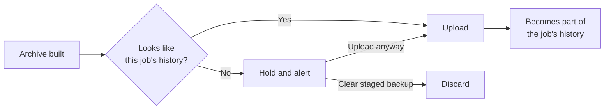

Each job builds up a picture of what its backups normally look like. When a new backup looks very different, such as a folder that suddenly emptied or files that ransomware encrypted, Edge holds it instead of uploading it. Your good snapshots on Central stay safe from retention until you decide.

Detection only uses file paths, sizes, file types, and how well the archive compresses. It never reads your files' contents.

## What Edge checks

| Check | Flags | Needs |
|---|---|---|
| **File count and size** | A folder that's less than half or more than double its usual size or file count | 5 earlier backups |
| **Compression** | An archive that stopped compressing. Encrypted files look random, so ransomware pushes the archive to about 100% of the original size. | 3 earlier backups over 1 MB |
| **Changed files** | Most files renamed or rewritten while the file count barely moved | 1 earlier backup, 20+ files |
| **File types** | One file type suddenly taking over, such as `.locked` going from 0% to most of the folder | 1 earlier backup, 20+ files |

Each job keeps its last 20 uploaded backups as its "normal". Photo and video folders that never compress well aren't flagged by the compression check, and adding lots of new files only trips the count check, not the changed-files check.

## Machine learning

Detection is unsupervised anomaly detection. Edge doesn't use a trained model. It learns each job's own baseline from that job's past backups and flags a backup that falls far outside it. There's nothing to download or train, nothing leaves the Edge, and a check takes milliseconds.

| Check | Method |
|---|---|
| File count and size | A robust z-score on a log scale. The baseline is the median of past backups, and the spread is the median absolute deviation (MAD). A backup is flagged only if it's at least 4 spreads from the median **and** at least half or double the usual value. |
| Compression | The archive's size divided by the original size, compared with the median ratio of past backups. |
| Changed files | Similarity to the last backup, estimated with MinHash over file paths and sizes. Flagged when under 25% of files are unchanged. |
| File types | The share of each file extension, compared with the last backup using the Jensen-Shannon divergence. Flagged when one new type takes over the folder. |

The median and MAD ignore a few odd backups in the history, where an average would be pulled off by them. The log scale treats growing from 1 GB to 2 GB the same as 10 GB to 20 GB.

The baseline keeps learning. Every uploaded backup joins the history, including one you approve with **Upload anyway**. A held backup doesn't join it until you approve it, so a bad backup can't teach Edge that bad is normal.

## When a backup is held

The job shows **held for review** with the reasons, for example:

> The archive barely compresses (100% of the original size, usually 41%), which is typical of encrypted files. Files ending in .locked went from 0% to 100% of the folder.

Edge also sends a high-priority [ntfy](/edge/notifications) alert if notifications are set up. Then either:

- **The change is expected**, such as a reorganized folder: click **Upload anyway**. The backup uploads and becomes part of the job's normal, so the same pattern won't be flagged again.
- **Something is wrong**: click **Clear staged backup** to discard it, then fix the folder, for example by [restoring](/edge/restore) the last good snapshot.

A held job stays held on later cycles while its files stay the same. If the files return to their last uploaded state, the hold clears by itself.

## Settings

Choose **Unusual backups** in **Edit Edge Settings**, or set `ANOMALY_MODE` in `.env`:

| Mode | Value | Does |
|---|---|---|
| Hold for review and alert | `hold` (default) | Keeps the archive staged and alerts |
| Alert only | `alert` | Uploads as normal and alerts |
| Off | `off` | No checks. History is still recorded, so turning it back on works right away. |

**Force Upload** always uploads without checking, since it's an explicit request.

Central runs its own, simpler check on archive sizes as a second line of defense. See [Unusual sizes](/central/snapshots#unusual-sizes).
