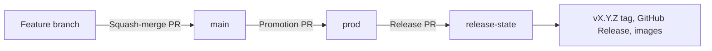

Central and Edge share one version number. Stable releases are tagged `vX.Y.Z` and published as Docker images with the same tag. To deploy one, see [Choose an image version](/quickstart#choose-an-image-version).

## Branches



| Branch | Role |
|---|---|
| `main` | Integration branch. A merge that changes an app publishes that app's `latest` image. |
| `prod` | Stable code. Releases are tagged on commits here. |
| `release-state` | Release metadata only: version, changelog, and the prod commit to tag. Never merged into a code branch. |

1. Open PRs against `main`. They are squash-merged.
2. A workflow keeps one `main` → `prod` promotion PR open. Merge it with **Create a merge commit**. Squashing would collapse every promoted commit into a single `chore:` commit, and nothing would be released. Changes only flow from `main` to `prod`. `prod` is never merged back into `main`.
3. When `prod` changes, [Release Please](https://github.com/googleapis/release-please) opens or updates a release PR against `release-state` with the next version and changelog.
4. Merging the release PR tags the recorded `prod` commit, publishes the GitHub Release, and builds the versioned images.

Nothing merges automatically. Both the promotion PR and the release PR need review.

## PR titles and versions

Because PRs into `main` are squash-merged, **the PR title becomes the commit message**, and commit messages decide the next version. CI rejects titles that are not [Conventional Commits](https://www.conventionalcommits.org/):

```text
<type>[(scope)][!]: <summary>
```

Use a lowercase type and an optional scope such as `edge`, `central`, or `docs`.

| Title | Example | Release effect |
|---|---|---|
| `feat:` | `feat(edge): add restore preview` | Minor: `1.2.3` → `1.3.0` |
| `fix:`, `perf:`, `revert:` | `fix(central): keep retention count after restart` | Patch: `1.2.3` → `1.2.4` |
| Any type with `!` | `feat(central)!: remove legacy upload API` | Major: `1.2.3` → `2.0.0` |
| `docs:`, `chore:`, `refactor:`, `test:`, `build:`, `ci:`, `style:`, `deps:` | `docs: explain Kubernetes paths` | None on its own. Ships with the next release |

A release takes the largest bump among the commits since the previous release. Use `!` for changes that need action on upgrade, such as removed configuration, an incompatible Edge ↔ Central protocol change, or a migration that cannot be rolled back.

The first stable release is `v1.0.0`.

## Maintainers

Repository setup, branch rulesets, retrying a failed publish, and recovering `release-state` are covered in [`RELEASING.md`](https://github.com/thesteau/3to1go/blob/main/RELEASING.md).
