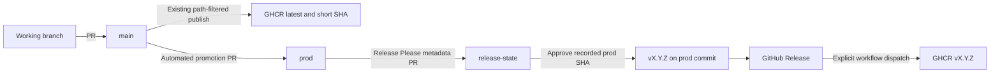

Normal working branches open PRs against `main`. `main` is the integration and unstable/nightly channel; `prod` is the stable production branch. Both run the existing Central, Edge, frontend, and Docker end-to-end checks. A third, independent branch, `release-state`, holds only release information; it is never merged into either code branch.



## Promotion and release gates

The `Promote main to prod` workflow creates a single `main` → `prod` PR automatically when main has commits not in prod. Since its head is the actual `main` branch, it follows additional changes automatically, including changes that do not affect the version. Review the current PR head before merging. Nothing merges automatically. If GitHub shows **Approve workflows to run** on the automation-created PR, an operator with write access must approve the required checks before merging.

Use **Create a merge commit** for promotion. Squashing or rebasing promotion loses the original commit history used for version calculation and makes repeated branch promotion harder. Do not delete `main` after merging.

On pushes to `prod`, `Stable release` runs the [Release Please](https://github.com/googleapis/release-please) library through `scripts/release-state.cts`. The bridge reads production commits since the previous released SHA and asks Release Please's Go strategy to calculate the version and changelog. Release Please's PR writer creates or updates one metadata PR from `release-please--branches--release-state` into `release-state`.

The metadata branch starts with an orphan commit, sharing no application history, and contains exactly three regular files:

| File | Purpose |
|---|---|
| `.release-please-manifest.json` | Current approved version for the repository |
| `CHANGELOG.md` | Accumulated Release Please changelog |
| `release.json` | Version, tag, exact prod SHA, previous release boundary, and approved notes |

See [Release state and recovery](/release-state-recovery) for the exact file shapes, how to recognize pending versus published state, and how to restore a deleted branch.

Review the version, notes, and selected production SHA, then merge the metadata PR. The merge event runs the bridge using trusted production code. It recalculates the proposed version and notes, checks the recorded SHA is in prod history, and creates the tag at that exact SHA. Release Please's release client publishes the GitHub Release. Advancing prod after metadata approval does not change which commit is tagged. Releases use a single version for Central and Edge.

<Note>
  The standard Release Please action cannot separate its metadata branch from the branch being tagged, or create a main → prod promotion PR. This repository therefore uses the pinned Release Please library with a custom bridge, plus the GitHub API promotion workflow. There are two PR gates: code promotion into prod and metadata approval into release-state. The bridge, rather than a standard action configuration, binds the release to the selected prod commit.
</Note>

`release-please-config.json` describes the bridge's supported configuration: the `go` strategy at repository root, unprefixed `vX.Y.Z` tags, and `initial-version: 1.0.0`. The library is pinned to `17.11.2` in `package.json` and the lockfile. The bridge validates these settings and does not support arbitrary Release Please plugins or extra-file updates. It does not version the private frontend tooling package or modify Go dependencies. Library upgrades must pass the release bridge tests because the bridge uses its programmatic strategy/PR/release APIs.

Use Conventional Commits in changes merged to main: `fix:` produces a patch release, `feat:` a minor release, and `feat!:` or a `BREAKING CHANGE:` footer a major release. With squash merges into main, use the appropriate PR title as the squash commit message. Docs/chore-only changes normally do not create a release PR; they are included when a releasable change is promoted. The metadata PR updates as more changes reach prod, including its selected SHA. Review its current head before merging. Stale approvals must be dismissed when automation updates it.

No back-merges or version-file synchronization are required. Neither main nor prod receives per-release version/changelog commits. Release state stays on its own branch, and Git tags point to application commits on prod. Do not merge the metadata branch into a code branch or add application files to it; validation rejects extra files, directories, and symlinks.

## One-time GitHub setup and v1.0.0

The checkout inspected during implementation had no prod branch, version tags, release configuration, or stable-image workflow. Live GitHub settings were not available for inspection.

1. Merge this implementation into main. Keep main as the default branch.
2. Create `prod` from that reviewed main commit using GitHub's branch UI. This bootstraps the automation code on prod; it does not create a release or image. Protect main and prod using the rules below.
3. In **Settings → Actions → General → Workflow permissions**, enable **Allow GitHub Actions to create and approve pull requests**. Organization policy must permit it. The workflows use GitHub's automatically supplied `GITHUB_TOKEN` with explicit job permissions; no PAT, GitHub App credential, or custom token secret is required.
4. Configure the Actions event policy below. Both metadata workflows must be on the default branch, main, before opening metadata PRs.
5. Run **Stable release** with branch **prod** and operation **plan** using Actions → Run workflow. The bridge automatically creates the orphan `release-state` branch and the first `1.0.0` metadata PR from releasable production history. Do not create release-state by copying main or prod. Protect release-state immediately, before merging its first PR. If no releasable commit exists, merge a real `feat:` or `fix:` change into main and merge the automatically created promotion PR.
6. Review and merge the metadata PR. The bridge creates `v1.0.0` at the recorded prod SHA and publishes its GitHub Release; the release workflow explicitly dispatches the build of both stable images. Wait for both matrix jobs to succeed before deploying.

`initial-version` affects only the first release, so it does not need removing. Future versions derive from Conventional Commits since the previous release. The metadata branch starts with an empty manifest and `release.json: null`, intentionally claiming no previously shipped version.

The built-in token suppresses downstream `pull_request_target` and `release` events created by automation. After planning, **Stable release** explicitly dispatches metadata validation; after publishing, it explicitly dispatches **Stable Docker Images**. Ordinary `pull_request` checks on automation-created promotion PRs may require operator approval. See [GitHub workflow trigger behavior](https://docs.github.com/en/actions/how-tos/write-workflows/choose-when-workflows-run/trigger-a-workflow).

## GitHub rulesets

Configure these in **Settings → Rules → Rulesets**. Repository files cannot enforce GitHub branch/tag rules or repository Actions settings. Preserve any additional existing required checks and review requirements.

For **main**, create an active branch ruleset targeting `refs/heads/main`: require a PR, at least one independent approval, dismiss stale approvals, require resolution of conversations, block force pushes, and restrict deletion. Require these exact status checks from GitHub Actions:

- `Run central unit tests`
- `Run edge unit tests`
- `Type-check, compile and run UI tests`
- `Edge to Central backup and recovery`

For **prod**, create the same active branch ruleset targeting `refs/heads/prod`, with the same four checks plus `Validate production PR source`. Require branches to be up to date before merging and at least one independent approval. The source check permits only same-repository `main` promotion. Do not require linear history on prod: promotion must preserve merge commits. Enable **Allow merge commits** in Settings → General → Pull Requests, and disable automatic head-branch deletion because `main` is a long-lived promotion head. If enforcing merge methods through rulesets, allow merge commits for prod.

For **release-state**, create an active branch ruleset targeting `refs/heads/release-state`: require a PR, at least one independent approval, dismiss stale approvals, require conversation resolution, block force pushes, restrict deletion, and require the **Validate release metadata** commit status from GitHub Actions. The validation workflow explicitly publishes this status on the metadata PR head SHA; its automatic workflow check runs against the base commit and is named **Run release metadata validation**. Select **Validate release metadata** as the required status. Require branches to be up to date before merging. Do not require application build/test checks on this branch: it has no application code. Its dedicated check validates the entire metadata tree, version/manifest agreement, previous release boundary, production ancestry, and Release Please's calculated version/notes. It accepts only the same-repository automation branch. All automation code executes from trusted prod, never from the metadata PR.

The release workflow needs initial permission to create release-state, but no bypass of branch protection after bootstrap: it creates/updates PRs and the operator merges them after checks/reviews. Keep ordinary direct pushes blocked on all three long-lived branches. Do not protect the temporary `release-please--branches--release-state` branch against force pushes; Release Please's PR writer rebuilds it as proposals change.

In **Settings → Actions → Policies**, create an applicable policy explicitly allowing `pull_request_target` for `.github/workflows/release-state-check.yml` and `.github/workflows/release-please.yml`. Also allow `workflow_dispatch` for both workflows and `push` for the release workflow. Allow GitHub Actions automation and operators who create/update/merge these PRs to trigger these workflows. Preserve broader organization/enterprise restrictions. GitHub's public-repository default policy can otherwise block this event; see [workflow execution policy setup](https://docs.github.com/en/actions/how-tos/administer/control-workflow-execution). This event lets default-branch workflows inspect/act on a metadata-only branch without placing workflow files on it.

Create an active **tag ruleset** targeting `v*`: restrict creations, updates, and deletions. Ensure the ruleset permits the release workflow using `GITHUB_TOKEN` to create version tags; a rule that restricts creation without permitting this workflow blocks publication. Enable **immutable releases** under Settings → General → Releases if available. Do not move or reuse production version tags. These settings do not prevent another GHCR writer from overwriting an image tag; limit package write access accordingly.

## Deploying images

The existing main image workflows are unchanged, including path filters, caches, and architectures. Relevant main pushes publish:

- `ghcr.io/thesteau/3to1go-central:latest` and `:<7-character-SHA>` (linux/amd64).
- `ghcr.io/thesteau/3to1go-edge:latest` and `:<7-character-SHA>` (linux/amd64, linux/arm64, linux/arm/v7).

`latest` is the unstable main channel. It is not a stable release alias, and publishing remains driven by matching paths rather than a nightly schedule. The deployment examples retain their existing `latest` defaults.

Stable Docker publishing is dispatched by **Stable release** after publication, and also supports published release events and manual retries. It requires a published, non-draft, non-prerelease GitHub Release targeting the exact recorded prod SHA. It validates the `vX.Y.Z` tag, checks the release target matches the tag's commit (also accepting a `prod` branch target), and confirms the commit is in prod history, then builds from that tag using the same app architectures. Stable publishing never writes `latest` or short-SHA tags. An authenticated registry check skips existing version tags rather than overwriting them and fails on unexpected registry errors.

For stable deployment, fetch the Compose examples and environment templates from the selected release tag, then set the app image explicitly before running Compose:

```yaml
# deploy-example/central/docker-compose.yml
image: ghcr.io/thesteau/3to1go-central:v1.0.0
```

```yaml
# deploy-example/edge/docker-compose.yml
image: ghcr.io/thesteau/3to1go-edge:v1.0.0
```

For the operator-adapted Edge Kubernetes example, set its Edge image to the same version tag. Central remains on Docker Compose. Upgrade by choosing the next published stable version and recreating the containers; stable tags do not track new releases automatically.

Metadata approval, GitHub Release creation, and the two image uploads are separate operations. If publication fails after metadata approval, run **Stable release** manually from **prod** with operation **publish**. It validates the approved metadata and retries without moving an existing tag; mismatched tags/releases fail rather than being replaced. New planning waits until the approved release is published. After publishing, the bridge checks for further production changes so a prod push that arrived during approval is not lost.

If an image upload fails, run **Stable Docker Images** manually from **prod**, supplying the existing release tag. Existing image tags are skipped, so a retry can complete the missing image. Do not recreate the release or move its tag. Workflow checks establish the release's branch and version; GHCR immutability also depends on package access controls and repository Actions permissions.
