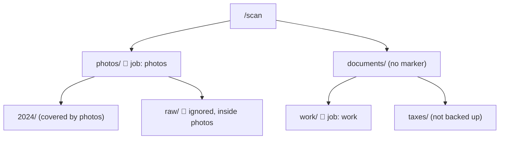

A **job** is a folder Scout backs up. Create and change jobs in Scout's Job Editor. Behind the scenes, the editor stores each job's settings in a file named `.upload_dir` in the folder, which you can also [write or edit yourself](#edit-the-upload_dir-file).

## Create a job from the UI

<Steps>
  <Step title="Find the folder">
    In **Directories Under Scan Root**, browse to the folder you want.
  </Step>
  <Step title="Open the Job Editor">
    Click **Edit** on the folder's row to open the **Job Editor**. **Browse files** on the row lets you look inside first.
  </Step>
  <Step title="Set options and save">
    Fill in the fields below and click **Save Job**. Scout writes the folder's `.upload_dir` for you.
  </Step>
</Steps>

| Field | Default | Description |
|---|---|---|
| Job Name | Folder name | Name used on Station. Letters, digits, `.`, `_`, and `-` only. |
| Exclude Patterns | none | One pattern per line. See [Exclusions](#exclusions). |
| Include hidden files | on | Back up files and folders whose names start with `.`. |
| Follow symlinks | off | Back up the targets of symbolic links instead of skipping them. |

**Stop Backing Up** removes the marker. Existing snapshots on Station are kept.

<Frame caption="The Job Editor writes the folder's .upload_dir settings.">
  
</Frame>

## Edit the .upload_dir file

Saving in the Job Editor writes the folder's `.upload_dir`. Writing that file yourself does the same thing as using the editor. Use it for scripts, configuration management, or folders you set up before Scout runs.

To create a job, create `.upload_dir` in the folder. An empty file uses the folder name as the job name:

```sh
touch /home/alice/photos/.upload_dir
```

To set or change options, add or edit YAML in the file. These are the same fields as the Job Editor:

```yaml .upload_dir
job_name: photos
include_hidden: true
follow_symlinks: false
exclude:
  - "*.tmp"
  - cache/
  - /exports/old/
```

Edits go both ways. Changes you make in the file show in the Job Editor, and saving in the editor rewrites the file. Deleting the file stops backing up the folder, like **Stop Backing Up**.

If the YAML is invalid or `job_name` has disallowed characters, Scout skips the job and shows the error on it.

Scout looks for new `.upload_dir` files every 30 seconds, so one you create by hand can take that long to appear under **Selected Jobs**. Edits to an existing file, deleted files, and jobs saved or removed in the Job Editor show up right away.

<Warning>
  Job names must be **unique** across the whole Scout. Two folders both named `photos` need different `job_name` values, such as `main-photos` and `projects-photos`.
</Warning>

Once Scout finds a marker, it doesn't look for more inside that folder. Nested folders are covered by the parent job.



📌 = folder with a `.upload_dir` marker.

Archives contain regular files and empty folders, and restore recreates both. A folder whose files are all excluded is kept as an empty folder. Special files are not archived, and the job root's `.upload_dir` is excluded. A job with no included files or folders is skipped. With **Follow symlinks** enabled, Scout stores the target's files rather than preserving the links themselves.

## Exclusions

Patterns are matched against paths relative to the job folder, using `/` as the separator.

| Pattern | Excludes |
|---|---|
| `*.tmp` | Any file or folder whose name matches, at any depth |
| `cache/` | Every folder named `cache`, at any depth, and everything inside it |
| `logs/*.log` | Paths matching the glob from the job root, such as `logs/app.log` |
| `/exports/old/` | Exactly `exports/old` under the job folder, and everything inside it |
| `/photos/image[1].jpg` | Exactly that file. Patterns starting with `/` are literal, so `[1]` is not treated as a glob. |

### Exclude from the file browser

On a job, click **Files & exclusions** to browse its files with their sizes.

- Click a folder to show its contents below it. Click it again to hide them.
- **Exclude** on a file or folder adds a literal `/…` pattern to the job's `.upload_dir` immediately.
- **Calculate folder size** totals the whole job, and **Calculate size** on a folder totals that folder. Totals are source sizes before compression, include excluded files, and skip symlinks and Scout's own runtime data.
- To include something again, remove its pattern in the Job Editor.

<Note>
  Exclusions apply to the **next** archive. If the job already has a staged archive, click **Clear staged backup** so it's rebuilt with the new exclusions.
</Note>

## Job actions

| Button | What it does |
|---|---|
| **Files & exclusions** | Browse the job's files and manage exclusions. |
| **Force Upload** | Upload this job even if its fingerprint is unchanged. Reuses a staged archive if one exists, so clear it first to build a fresh backup. Station may report an identical encrypted archive as a duplicate. |
| **Restore** | Restore a snapshot from Station into this folder. See [Restore](/scout/restore). |
| **Edit** | Open the Job Editor. |
| **Clear staged backup** | Shown when an archive is waiting to upload. Deletes it and resets retry state. Your files, backup history, and Station snapshots are kept. |

**Cancel operation** at the top of the page stops the backup cycle or forced upload in progress, including compression and upload retries. Incomplete archives are discarded, and a fully built archive stays staged for retry. Cancel before clearing a staged backup.

## When a job is backed up

On each scheduled cycle, Scout compares the job's file paths and sizes with its last backup. It only builds and uploads a new snapshot when they differ.

If a failed upload has a staged archive ready for retry, Scout retries that archive first. New edits and exclusions are picked up when a fresh archive is built.

To run a cycle for all jobs without waiting for the schedule, click **Run Backup Cycle Now**. It follows the same rule, so unchanged jobs are skipped.

<Tip>
  An edit that keeps a file's size the same isn't detected automatically. Use **Force Upload** to capture it. See [Design decisions](/concepts/design-decisions#path-and-size-fingerprinting).
</Tip>
