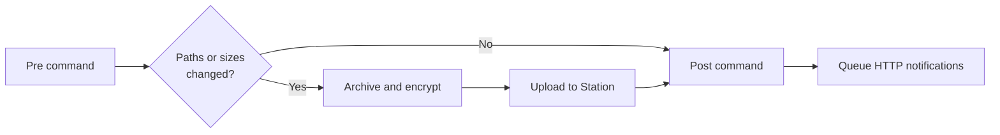

Hooks run a shell command around each job in a backup cycle.



- **Pre command**: before Scout scans the job. Scout waits for it, so it can prepare files in the folder first.
- **Post command**: after the job finishes, whether it uploaded, was unchanged, or failed. Cancelling skips it.

Hooks run in scheduled cycles and **Run Backup Cycle Now**, but not for **Force Upload**.

## Set up

<Steps>
  <Step title="Open Custom Scripts">
    In Scout, click **Custom Scripts**.
  </Step>
  <Step title="Upload a script (optional)">
    Under **Uploaded Items**, upload up to **3** files. Only `.sh` scripts and `.txt` helper files are allowed, and they must be UTF-8 text. `.sh` files are made executable, and Windows line endings are converted.
  </Step>
  <Step title="Set the commands">
    Enter a **Pre Command** and/or **Post Command**. Either:
    - the name of an uploaded script, such as `before-backup.sh`, or
    - any shell command, such as `curl -fsS https://hc-ping.com/your-id`.
  </Step>
</Steps>

Commands run with `sh -c` inside the Scout container, from the hook scripts folder (`/hook-scripts`). Each command has a **5-minute** timeout and stops if you click **Cancel operation**. Command text, standard output, and standard error are omitted from Scout's logs to protect secrets. Timeout and failure outcomes are logged. A failing hook doesn't stop the backup.

The same commands run for **every** job. Use `THREETOONEGO_JOB_NAME` to act on specific jobs.

Scout prepares different jobs concurrently, so their hooks can overlap. Keep per-job output separate when your scripts write files.

## Environment variables

| Variable | Value |
|---|---|
| `THREETOONEGO_APP` | `scout` |
| `THREETOONEGO_HOOK_PHASE` | `pre` or `post` |
| `THREETOONEGO_HOOK_SCRIPTS_DIR` | The hook scripts folder |
| `THREETOONEGO_SCOUT_ID` | This Scout's ID |
| `THREETOONEGO_SCOUT_INSTANCE_ID` | This installation's instance ID |
| `THREETOONEGO_JOB_NAME` | Backup job name |
| `THREETOONEGO_JOB_ROOT` | Job folder inside the container |
| `THREETOONEGO_STATE_KEY` | Key used for the job's local state |
| `THREETOONEGO_LAST_STATUS` | Job's last status, such as `success` |
| `THREETOONEGO_LAST_ERROR_CATEGORY` | Category of the last error, if any |
| `THREETOONEGO_LAST_ERROR_DETAIL` | Detail of the last error, if any |
| `THREETOONEGO_STORED_AS` | Filename of the last upload on Station |
| `THREETOONEGO_PRUNED` | Old snapshots Station removed after the last upload |
| `THREETOONEGO_DUPLICATE` | `true` if Station already had the last upload |
| `THREETOONEGO_PENDING_ARCHIVE` | Staged archive waiting to upload, if any |
| `THREETOONEGO_PENDING_FINGERPRINT` | Fingerprint of the staged archive |
| `THREETOONEGO_PENDING_TIMESTAMP` | Timestamp of the staged archive |
| `THREETOONEGO_UPLOAD_ID` | Current upload session ID |
| `THREETOONEGO_UPLOAD_OFFSET` | Bytes uploaded so far |
| `THREETOONEGO_NEXT_RETRY_AT` | When a failed upload will retry |

In the **pre** command these describe the job's state from its previous run. In the **post** command they describe the run that just finished.

## Example: report each job to a health check

```sh after-job.sh
#!/bin/sh
# Ping a health check per job, adding /fail when the job needs attention.
url="https://hc-ping.com/your-uuid/$THREETOONEGO_JOB_NAME"
case "$THREETOONEGO_LAST_STATUS" in
  success|skipped_unchanged|skipped_empty) ;;
  *) url="$url/fail" ;;
esac
curl -fsS -m 10 "$url" > /dev/null
```

Common `THREETOONEGO_LAST_STATUS` values after a job:

| Status | Meaning |
|---|---|
| `success` | Uploaded to Station |
| `skipped_unchanged` | Nothing changed since the last backup |
| `skipped_empty` | The folder had no files or folders to back up |
| `held_for_review` | Looked unusual and is waiting for you. See [Unusual backups](/scout/unusual-backups). |
| `retry_scheduled`, `waiting_retry` | Upload failed and will be retried |
| `circuit_open` | Station was unreachable too many times. Scout waits before retrying |
| `manual_intervention_required` | Retries ran out. Check the job in Scout's UI |
| `unexpected_exception` | Something else went wrong. See Scout's logs |

Set **Post Command** to `after-job.sh`.

<Note>
  The Scout image is a minimal Alpine image with `sh` and `curl`. Other tools, such as database clients, aren't included. To dump a database before a backup, run the dump on the host on a schedule ahead of Scout's cycle.
</Note>

## Notifications and secrets

Use [Integrations](/shared/integrations) for HTTP notifications instead of embedding webhook credentials in commands or scripts. For local scripts that need credentials, mount a separate read-only secret file outside `/hook-scripts` and selected backup jobs. Commands and uploaded scripts can be viewed through authenticated APIs. Hooks inherit the app environment and aren't sandboxed; run only trusted scripts. See [Integration secrets](/integrations/secrets#secrets-used-by-custom-scripts).
