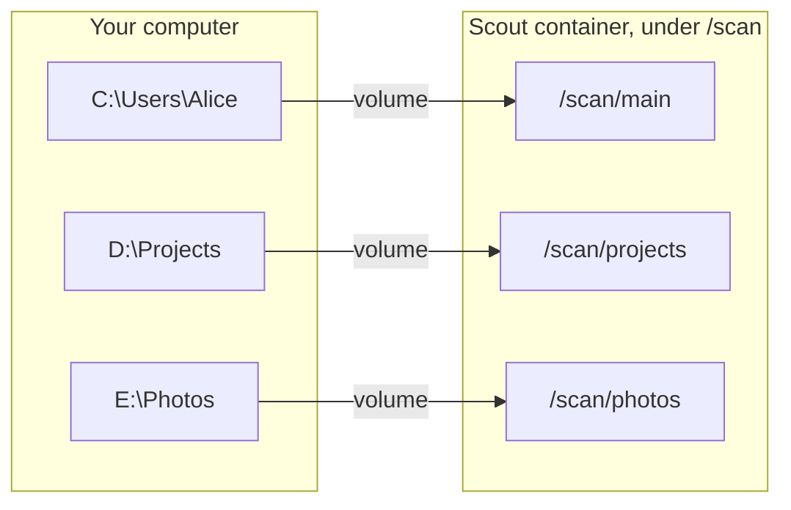

Scout can only see folders that Docker mounts beneath `/scan` inside the container. To back up more than one location, add one volume entry per folder. Your files stay where they are on your computer, including on other drives.

Each entry has the form:

```text
"folder on your computer:folder inside Scout"
```

For example, `"D:/Projects:/scan/projects"` makes `D:\Projects` appear as `/scan/projects` in Scout. Use forward slashes in Compose, including for Windows paths.



## Set it up

<Steps>
  <Step title="Open docker-compose.yml">
    Find the `volumes:` section under the `scout` service.
  </Step>
  <Step title="Replace the single-folder entry">
    Remove this line:

    ```yaml
          - ${SCAN_DIR:-./scan}:/scan
    ```

    and add one entry per folder in its place. Give each a different name under `/scan`:

    ```yaml docker-compose.yml
        volumes:
          - ./config:/config
          - ./hook-scripts:/hook-scripts
          - "C:/Users/Alice:/scan/main"
          - "D:/Projects:/scan/projects"
          - ./state:/data/state
          - ./spool:/data/spool
    ```

    Keep the other volume entries unchanged. The example Compose file includes these lines as comments. Remove the `#` to activate them.

    On Linux, use paths such as `"/home/alice:/scan/main"` and `"/mnt/data/projects:/scan/projects"`.
  </Step>
  <Step title="Update .env">
    Remove `SCAN_DIR` from `.env`, since the entries above now name the folders directly. If you set `SCAN_ROOT`, keep it at `/scan`.
  </Step>
  <Step title="Recreate the container">
    From the folder with the Compose file:

    ```sh
    docker compose up -d --force-recreate scout
    ```
  </Step>
  <Step title="Choose what to back up">
    Refresh Scout's UI. The folder browser now shows:

    ```text
    /scan
      main       (C:\Users\Alice on your computer)
      projects   (D:\Projects on your computer)
    ```

    Create jobs for the folders you want. See [Backup jobs](/scout/backup-jobs).
  </Step>
</Steps>

<Warning>
  Don't make `/scan` itself a job. It would become one combined job covering every mounted folder.
</Warning>

## Add another drive later

Add another line to the same `volumes` section, recreate the container, refresh Scout, and create a job for the new folder:

```yaml
      - "E:/Photos:/scan/photos"
```

Adding a volume only makes a folder **visible**. It isn't backed up until you create a job for it.

## Things to know

- **Job names must be unique across all mounted folders.** The `main` and `projects` labels don't separate same-named jobs on Station, so use names like `main-photos` and `projects-photos`.
- **Mounts need write access** for Scout to save markers and restore files.
- **Max Depth counts the extra level.** The `/scan/<name>` folders add one level, so raise **Max Depth** in settings if your markers are deep.
- **Moving an existing folder under a new mount?** Keep its job name so its history on Station continues. Scout tracks local state by path, so the next cycle may upload it again.

The same steps work with the build-from-source Compose file in `scout/`.
