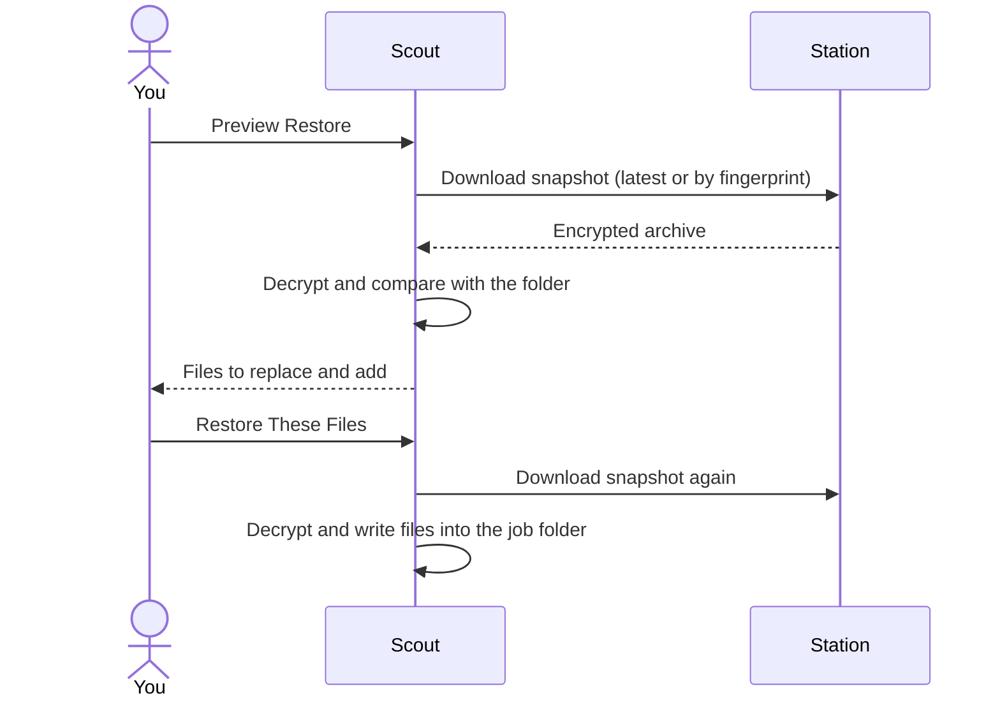
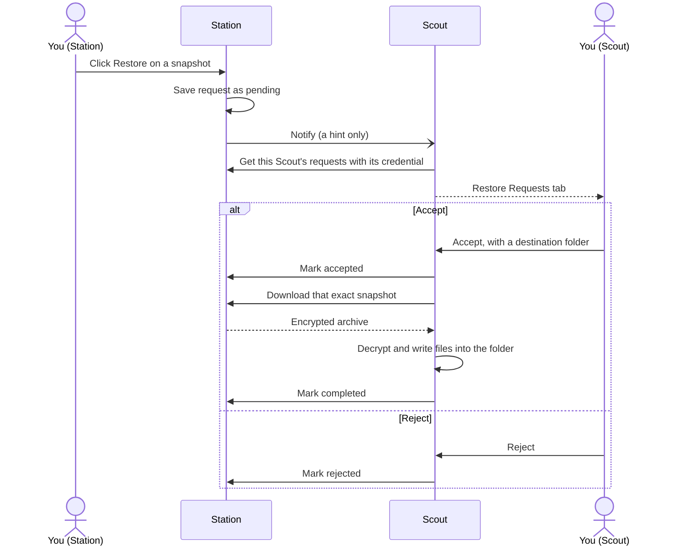

Scout can download a snapshot from Station, decrypt it with its own key, and extract it back into the job's folder.



<Warning>
  Restore **overwrites** local files that are also in the snapshot. Files that aren't in the snapshot are left untouched. Check the preview before confirming.
</Warning>

## Restore the latest snapshot

<Steps>
  <Step title="Open Restore">
    On the job in **Selected Jobs**, click **Restore**.
  </Step>
  <Step title="Leave the fingerprint empty">
    An empty **Snapshot fingerprint** means the latest snapshot.
  </Step>
  <Step title="Preview">
    Click **Preview Restore**. Scout shows how many files the snapshot has, and how many would replace existing files or be added.
  </Step>
  <Step title="Confirm">
    Click **Restore These Files** to write the files into the job's folder. Search and the **All**, **Replace**, and **Add** filters only change what the preview shows. They don't pick a subset to restore.
  </Step>
</Steps>

<Frame caption="Restore preview showing one missing file to add and one local file to replace.">
  
</Frame>

## Restore a specific snapshot

Each snapshot's fingerprint is part of its filename on Station, and is shown as **FP** next to each snapshot in Station's UI:

```text
photos__2026-09-30T02-00-00Z__abcdef12.tar.zst
                              ^^^^^^^^ fingerprint
```

Enter those eight characters (or the full 64-character fingerprint) in **Snapshot fingerprint**, then preview and confirm as above.

Forced backups can share a fingerprint. When several snapshots match, Scout restores the newest. To get an older one, use its **Download** button in Station instead.

A job can only restore its **own** snapshots. You can't restore one job's snapshot into another job's folder.

## Restore requests from Station

Use this when Station still has a snapshot but the folder is gone from Scout. An admin clicks **Restore** on a snapshot in Station. Station only saves the request. Scout lists it under **Restore Requests**, and nothing is restored until someone accepts it in Scout.



<Steps>
  <Step title="Request it in Station">
    Save that Scout's encryption key in Station, then click **Restore** on the snapshot. The key stays in your browser.
  </Step>
  <Step title="Open Restore Requests in Scout">
    The **Restore Requests** tab appears next to **Jobs** when Station has a request for this Scout.
  </Step>
  <Step title="Accept or reject">
    Enter the destination folder and click **Accept**, or click **Reject**.
  </Step>
</Steps>

- The destination is a folder under the scan root. It may be a folder that no longer exists, and Scout creates it.
- Scout only acts on requests it reads from Station itself. It never trusts the notification.
- If the restore fails, the request stays accepted and Scout shows **Retry Restore**. **Reject** dismisses it.

## Requirements

- Scout must be able to reach Station, with a valid credential.
- Scout must have the **same encryption key** that encrypted the snapshot. If it doesn't, the restore fails with "unable to decrypt snapshot with this Scout key".

<Note>
  After you [rotate the key](/scout/encryption-key#rotate-the-key), Scout can no longer restore snapshots made with the old key, and Station's UI stops accepting the old key after Scout's next upload. Download any older snapshots you need **before** rotating.
</Note>

## Rebuilding a lost machine

Scout only restores snapshots belonging to its own **instance ID**, which is stored in `config/installation.id`. A fresh install gets a new instance ID, so it can't restore the old machine's snapshots through Scout on its own.

**If you have the old Scout's whole `config` folder** (it includes `installation.id`, `encryption.key`, and the saved settings and credential):

<Steps>
  <Step title="Put the config folder back">
    Place it next to `docker-compose.yml` before starting Scout for the first time.
  </Step>
  <Step title="Use the same Scout ID">
    Set `SCOUT_ID` to the old value in `.env`.
  </Step>
  <Step title="Recreate the job and restore">
    Create the job with the **same job name**, then use **Restore**.
  </Step>
</Steps>

**If you only have `encryption.key`**, download the snapshots from [Station's UI](/station/snapshots#download-a-snapshot) with that key, and extract them by hand:

```sh
tar --zstd -xf photos__2026-09-30T02-00-00Z__abcdef12.tar.zst -C /path/to/restore
```

<Tip>
  Backing up Scout's whole `config` folder, not just the key, makes this much easier.
</Tip>
