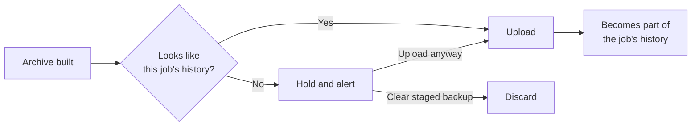

Each job builds up a picture of what its backups normally look like. In the default **Hold and alert** mode, Scout holds a newly built backup if its statistics differ sharply from the job's history, such as a large drop in file count or a sudden loss of compression. A held archive isn't uploaded, so it doesn't trigger retention of that job's snapshots on Station.

The checks use file paths, sizes, filename extensions, and the archive's compression ratio. They don't inspect file contents or identify malware. Scout still reads the included files to build the archive.

<Note>
  These checks run when Scout builds a new archive. Edits that keep the same file paths and sizes don't trigger a scheduled backup or these checks. **Force Upload** bypasses the checks. See [Path-and-size fingerprinting](/concepts/design-decisions#path-and-size-fingerprinting).
</Note>

## What Scout checks

| Check | Flags | Needs |
|---|---|---|
| **File count and size** | File count or source size drops to half its usual value or grows to double, and falls far outside its normal range | 5 earlier backups |
| **Compression** | A previously compressible job whose archive is now at least 90% of the source size, with a ratio increase of at least 25 percentage points | 3 earlier backups with at least 1 MiB of source files |
| **Changed files** | Most file paths or sizes changed while the file count barely moved | 1 earlier backup, 20+ files in both backups |
| **File types** | One filename extension suddenly taking over, such as `.locked` going from 0% to most of the folder | 1 earlier backup, 20+ files in both backups |

Each job keeps its last 20 uploaded backups as its "normal". Photo and video folders that never compress well aren't flagged by the compression check, and adding lots of new files only trips the count check, not the changed-files check.

## Machine learning

Scout uses statistical anomaly detection rather than a pretrained model. It builds each job's baseline from that job's past backups and flags a backup that falls far outside it. No model needs to be downloaded or trained. The checks and their history stay on Scout; configured notifications can send alerts with the reasons.

| Check | Method |
|---|---|
| File count and size | A robust z-score on a log scale. The baseline is the median of past backups, and the spread is the median absolute deviation (MAD). A backup is flagged only if it's at least 4 spreads from the median **and** at least half or double the usual value. |
| Compression | The archive's size divided by the original size, compared with the median ratio of past backups. |
| Changed files | Similarity to the last backup, estimated with MinHash over file paths and sizes. Flagged when under 25% of files are unchanged. |
| File types | The share of each filename extension, compared with the last backup using the Jensen-Shannon divergence. Flagged when a previously rare extension takes over the folder. |

The median and MAD ignore a few odd backups in the history, where an average would be pulled off by them. The log scale treats growing from 1 GB to 2 GB the same as 10 GB to 20 GB.

The baseline keeps learning. Every uploaded backup joins the history, including one you approve with **Upload anyway**. A held backup doesn't join it until you approve it, so a bad backup can't teach Scout that bad is normal.

## When a backup is held

The job shows **held for review** with the reasons, for example:

> The archive barely compresses (100% of the original size, usually 41%), which is typical of encrypted files. Files ending in .locked went from 0% to 100% of the folder.

Scout also emits an `unusual-backup` event to matching [integrations](/scout/notifications). Enable details on the destination if the alert should include the reasons. Then either:

- **The change is expected**, such as a reorganized folder: click **Upload anyway**. The backup uploads and joins the job's history. Future backups are compared against that updated history, so some checks may still flag them while the baseline adjusts.
- **Something is wrong**: click **Clear staged backup** to discard it, then fix the folder, for example by [restoring](/scout/restore) the last good snapshot.

A held job stays held on later cycles while its path-and-size fingerprint stays the same. If that fingerprint returns to its last successfully uploaded value, the hold clears by itself.

## Settings

Choose **Unusual backups** in **Edit Scout Settings**, or set `ANOMALY_MODE` in `.env`:

| Mode | Value | Does |
|---|---|---|
| Hold and alert | `hold` (default) | Keeps the archive staged and alerts |
| Alert only | `alert` | Uploads as normal and alerts |
| Off | `off` | No checks. History is still recorded, so turning it back on works right away. |

**Force Upload** always uploads without checking, since it's an explicit request.

Station runs its own, simpler check on archive sizes as a second line of defense. See [Unusual sizes](/station/snapshots#unusual-sizes).
