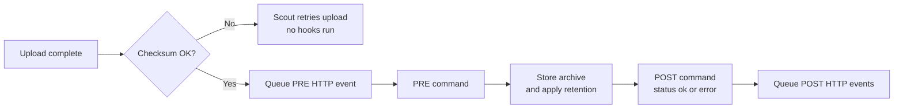

Hooks run a shell command at two points while Station stores an upload. Use them to trigger an offsite sync, write to a log, or ping a monitoring service.



- **Pre command**: after the upload passes its checksum, before Station stores it. Station waits for it to finish.
- **Post command**: after storing, with `THREETOONEGO_STATUS` set to `ok` or `error`. Retrying an upload that already finished doesn't rerun hooks.

## Set up

Follow the [shared custom-script setup](/shared/hooks#set-up) for uploading files, configuring independent PRE and POST commands, execution limits, and secret handling.

## Environment variables

Use shell variables such as `$THREETOONEGO_JOB_NAME` in commands and scripts. The `{{ job_name }}` syntax applies to [HTTP message and JSON templates](/shared/integrations#payloads-and-templates), and is not expanded in shell scripts.

Every hook gets these variables:

| Variable | Value |
|---|---|
| `THREETOONEGO_APP` | `station` |
| `THREETOONEGO_HOOK_PHASE` | `pre` or `post` |
| `THREETOONEGO_HOOK_SCRIPTS_DIR` | The hook scripts folder |
| `THREETOONEGO_SCOUT_ID` | Sending Scout's ID |
| `THREETOONEGO_SCOUT_INSTANCE_ID` | Sending Scout's instance ID |
| `THREETOONEGO_JOB_NAME` | Backup job name |
| `THREETOONEGO_UPLOAD_ID` | Upload session ID |
| `THREETOONEGO_NAMESPACE` | Storage path, `scout_id/instance_id/job_name` |
| `THREETOONEGO_FILENAME` | Uploaded filename |
| `THREETOONEGO_FINGERPRINT` | Snapshot fingerprint |
| `THREETOONEGO_TIMESTAMP` | Snapshot timestamp |
| `THREETOONEGO_ARCHIVE_SHA256` | SHA-256 of the encrypted archive |
| `THREETOONEGO_ARCHIVE_SIZE_BYTES` | Archive size |
| `THREETOONEGO_SOURCE_ADDRESS` | IP the upload came from |
| `THREETOONEGO_ADVERTISED_URL` | URL the Scout advertises, if set |
| `THREETOONEGO_STAGED_PATH` | Where the upload is staged before storing |

The **post** command also gets:

| Variable | Value |
|---|---|
| `THREETOONEGO_STATUS` | `ok` or `error` |
| `THREETOONEGO_STORED_AS` | Final stored filename |
| `THREETOONEGO_PRUNED` | Number of old snapshots removed by retention |
| `THREETOONEGO_DUPLICATE` | `true` if Station already had this snapshot |
| `THREETOONEGO_UNUSUAL` | Why the archive's size looks unusual, or empty. See [Unusual sizes](/station/snapshots#unusual-sizes). |

## Example: write a snapshot receipt

```sh after-upload.sh
#!/bin/sh
[ "$THREETOONEGO_STATUS" = "ok" ] || exit 0
printf '%s\n' "stored $THREETOONEGO_NAMESPACE/$THREETOONEGO_STORED_AS" >> /hook-scripts/receipts.log
```

Set **POST command** to `after-upload.sh`. This script manages its own log; keep it private and arrange rotation on the host.

<Note>
  The Station image is a minimal Alpine image with `sh` and `curl`. Tools like `rclone` aren't included. Run those on the host or in another container that reads the same backup folder.
</Note>

## Notifications and secrets

Use [HTTP notifications](/shared/integrations#station-events) for remote messages. For script credentials and execution permissions, see [Custom scripts](/shared/hooks#secrets-and-permissions) and [Integration secrets](/integrations/secrets#secrets-used-by-custom-scripts).
