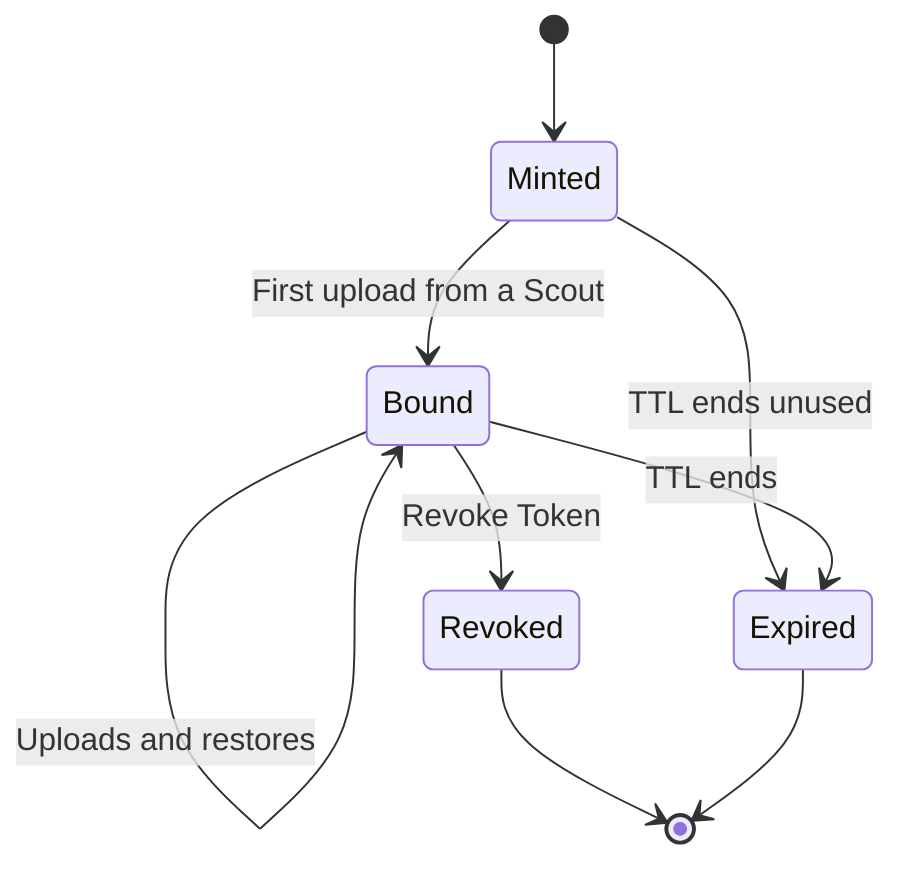

Scouts authenticate to Station with a signed credential that Station mints. Station keeps a record of each credential but never stores the raw token.

## Mint a credential

<Steps>
  <Step title="Open the dialog">
    In Station, click **Mint Edge Credential**.
  </Step>
  <Step title="Choose options">
    - **TTL Days**: how long the credential is valid, from 1 to 3650 days (default 365).
    - **Shared credential**: leave off for one Scout. See [Shared credentials](#shared-credentials).
  </Step>
  <Step title="Mint and copy">
    Click **Mint Credential**, then **Copy**.
  </Step>
  <Step title="Paste it into Scout">
    In Scout, open **Edit Edge Settings** and paste it into **Edge Credential**, then save.
  </Step>
</Steps>

<Warning>
  The credential is shown **once**. Paste it into Scout before closing the dialog. If you lose it, mint another.
</Warning>

## How binding works

A normal credential is **single-instance**: it binds to the first Scout installation that uploads with it, and Station rejects it from any other installation.

## Shared credentials

To use one credential on several machines, turn on **Shared credential** and set **Shared Instance Limit** to the number of Scout installations allowed to use it (2 to 10000).

Each machine still gets its own instance ID, so their snapshots stay separate on Station.

## Revoke a credential

Click **Revoke Token** on the Scout instance in Station's snapshot view. That Scout can no longer upload or restore. Snapshots already stored are **kept**, and you can still download them from Station's UI. Revoking a shared credential stops **every** Scout using it.

<Note>
  A credential can only be revoked after a Scout has reported in with it. An unused credential just expires at the end of its TTL.
</Note>

## Replace a credential

Revoke the old credential first, because Station rejects a new one while the instance is still bound to the old one. The replacement binds on Scout's next upload, not when you save it.

## Delete a Scout instance

**Delete Instance** permanently deletes **all snapshots** for that instance and removes it from Station, along with the archive size history used for [unusual sizes](/station/snapshots#unusual-sizes). It can't be undone. If Station finds no backup files for an instance, it offers to remove the stale entry instead.

Deleting an instance doesn't revoke its credential. Stop the Scout or revoke the credential first if it must stop uploading.
