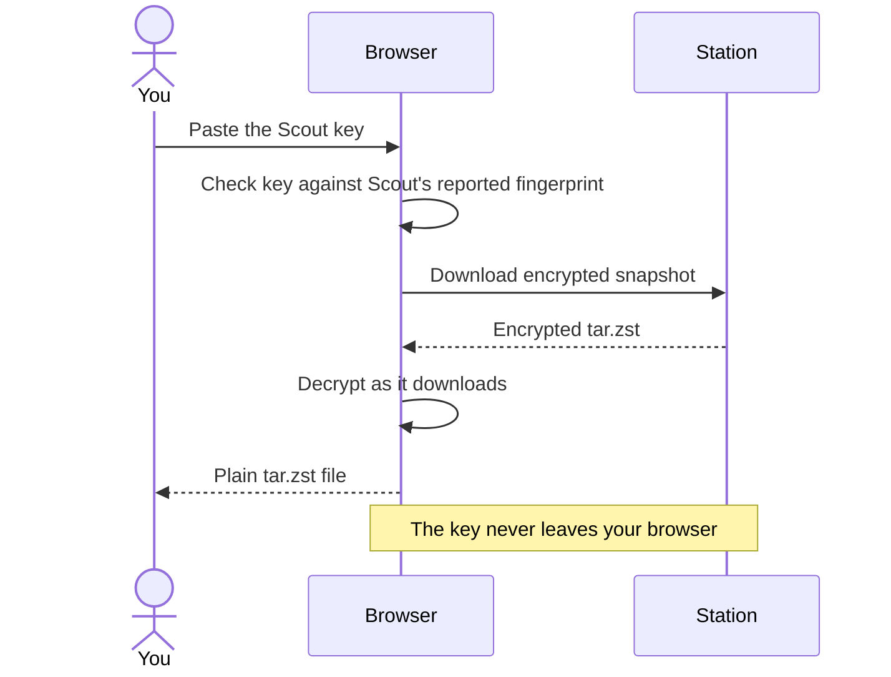

Station's main page, **Stored Snapshots**, lists every Scout, each of its instances, their jobs, and each job's snapshots. The newest snapshot of each job is tagged **latest**.

<Frame caption="An expanded Scout instance with a stored snapshot in a local demo deployment.">
  
</Frame>

## How snapshots are stored

Each snapshot is one encrypted `tar.zst` file in Station's backup folder:

```text
/backups/<scout_id>/<scout_instance_id>/<job_name>/<job>__<timestamp>__<fingerprint>.tar.zst
```

The fingerprint in the filename is the first eight characters of Scout's path-and-size fingerprint. You can use it to [restore a matching snapshot](/scout/restore#restore-a-specific-snapshot) from Scout, but multiple snapshots can share it.

## Download a snapshot

Click **Download** on a snapshot. The first time, Station asks for that Scout's **Scout key**.



<Note>
  Your browser does the decrypting, so open Station over HTTPS or through `localhost`. A plain HTTP address on your network won't work.
</Note>

<Steps>
  <Step title="Copy the key from Scout">
    In Scout's UI, find **Scout Key** and click **Copy**. See [Scout key](/scout/scout-key).
  </Step>
  <Step title="Paste it into Station">
    Paste it when Station prompts. Station checks it against the key fingerprint that Scout reported, so a wrong key is caught before decryption starts.
  </Step>
  <Step title="Save the file">
    The snapshot is decrypted in your browser as it downloads, and saved as a regular `tar.zst` archive.
  </Step>
</Steps>

The key stays in that browser tab and is never sent to Station's server. **Clear** removes it. Signing out, an expired session, or closing the tab clears every saved key.

To extract the downloaded archive:

```sh
tar --zstd -xf photos__2026-09-30T02-00-00Z__abcdef12.tar.zst
```

<Tip>
  To put files back on the original machine, [restore from Scout](/scout/restore) instead. It downloads, decrypts, and extracts for you.
</Tip>

## Restore a snapshot to Scout

Choose a target device next to **Restore**, then click **Restore** on a snapshot. The original Scout is selected by default. Save that Scout’s key first for a same-device restore. For another device, supply the original snapshot’s Scout key on the receiving Scout when accepting the request. Scout's operator accepts or rejects the request in Scout. See [Restore requests from Station](/scout/restore#restore-requests-from-station).

## Delete a snapshot

Click **Delete** on a snapshot and confirm. This permanently removes the file.

## Retention

After each upload, Station keeps the most recent snapshots for that job **and Scout instance** and deletes older ones. **Keep Last Snapshots** in **Edit Station Settings** sets how many (default `3`). Scout instances never prune each other's snapshots, even if they share a `SCOUT_ID`.

Age is judged by each file's modification time, so keep those times when copying archives back into the backup folder.

## Unusual sizes

Station remembers the size of each job's last 20 uploads. When a new archive is less than half or more than double the job's usual size, and far outside its normal range, the snapshot gets an **unusual size** badge. Hover over it to see why, for example:

> This archive is 39.1 KB, but this job's archives are usually about 979.0 KB.

Station also sends an [ntfy alert](/station/notifications#unusual-size-alerts) and passes the reason to the [post hook](/station/hooks). The check needs 5 earlier uploads and can be turned off with **Unusual uploads** in **Edit Station Settings**.

Station only sees archive sizes, and by the time an archive arrives it has already left Scout, so it can flag but not hold. Scout's own checks are stronger and can hold a backup before it uploads. See [Unusual backups](/scout/unusual-backups).

## Integrity checks

Station can re-check stored snapshots with SHA-256 to catch files corrupted or changed on disk. Each check covers the **latest snapshot of every job**, not the full history.

- **Run Now**: start a check from the integrity bar on the snapshots page.
- **Scheduled**: set **Integrity Check (hours)** in **Edit Station Settings**. `0` turns scheduled checks off.

<Note>
  Station reads the check interval when it starts. After changing it, restart Station: `docker compose restart station`.
</Note>

The bar shows the latest result and when it ran. Results reset when Station restarts. Snapshots without a recorded checksum are skipped. A passing check confirms the stored bytes are intact, not that you still have the key to decrypt them.
