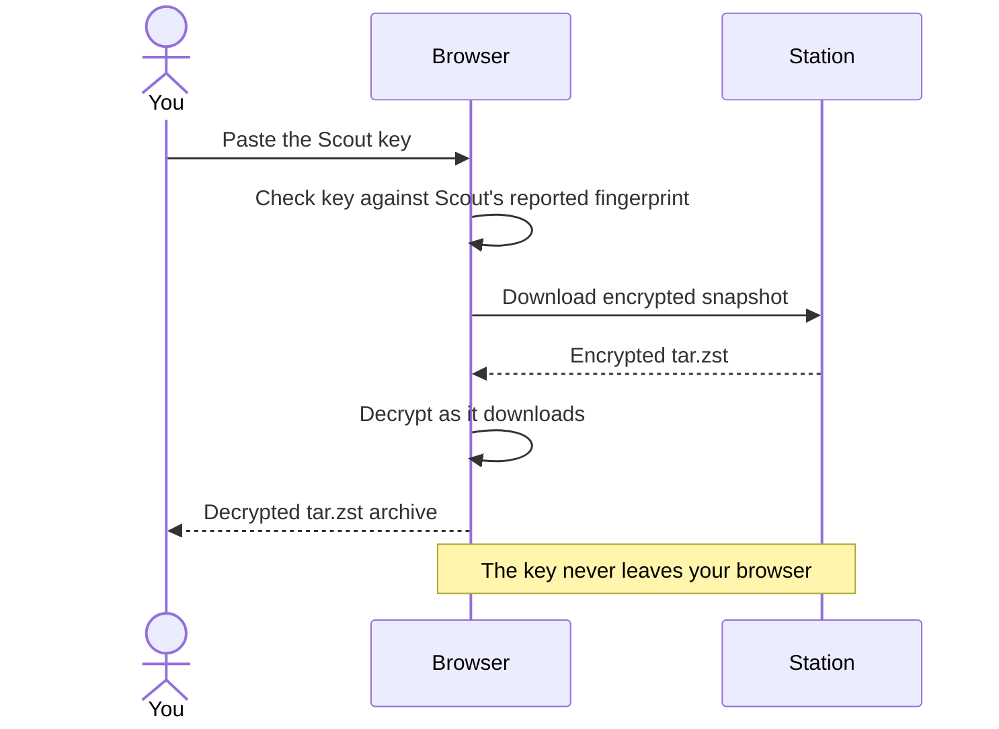

Station's main page, **Stored Snapshots**, lists every Scout, each of its instances, their jobs, and each job's snapshots. The newest snapshot of each job is tagged **latest**.

<Frame caption="Backup search finding Immich snapshots across two Scouts in a local demo deployment.">
  
</Frame>

## Search backups

Use **Search backups** above the snapshot list to find a stored backup across all Scouts and instances. Matching snapshots appear under their Scout and job, and matching Scout cards expand automatically. **Clear** shows the full list again.

Type a Scout ID, instance ID, job name, or snapshot filename. Text matches are case-insensitive and can match part of a name. Combine words, dates, and sizes in the same field: every term must match the same snapshot. Spaces mean AND; writing `and` or `AND` between terms is optional.

| Search | Finds |
| --- | --- |
| `immich` | Snapshots with `immich` in their job, Scout, instance, or filename |
| `immich and 2026` | Immich snapshots from 2026, across all Scouts |
| `2026-10` | Snapshots from October 2026 |
| `2026-10-07` | Snapshots from October 7, 2026 |
| `100MB-2GB` | Snapshots whose stored archive size is between 100 MB and 2 GB, including both limits |
| `immich >=500MB <2GB` | Immich snapshots at least 500 MB and smaller than 2 GB |
| `scout-home immich 2026` | Immich snapshots from 2026 on a Scout whose ID contains `scout-home` |

Dates accept `YYYY`, `YYYY-MM`, or `YYYY-MM-DD` and use your browser's timezone, matching the date displayed in the list. Sizes refer to the stored archive, including its encryption overhead, rather than the original files. Use `B`, `KB`, `MB`, `GB`, or `TB` (case-insensitive); `KiB`, `MiB`, `GiB`, and `TiB` also work. As in the UI's size display, each step is 1024. Put a unit on both ends of a range. Spaces around units and operators are allowed, such as `100 MB - 2 GB`. Comparisons support `>`, `>=`, `<`, `<=`, and `=`; a size without an operator matches that exact byte size.

Search uses Station's snapshot metadata and doesn't require a Scout key. Once you find a backup, click **View** and supply its Scout key to browse or search paths inside it. Hover over **?** beside the search label for a quick reminder, or click **Search guide** to open these details in a new tab.

## How snapshots are stored

Each snapshot is one encrypted `tar.zst` file in Station's backup folder:

```text
/backups/<scout_id>/<scout_instance_id>/<job_name>/<job>__<timestamp>__<fingerprint>.tar.zst
```

The fingerprint in the filename is the first eight characters of Scout's path-and-size fingerprint. You can use it to [restore a matching snapshot](/scout/restore#restore-a-specific-snapshot) from Scout, but multiple snapshots can share it.

## Download a snapshot

Click **Download** on a snapshot. The first time, Station asks for that Scout's **Scout key**.



<Note>
  Your browser does the decrypting, so open Station over HTTPS or through `localhost`. A plain HTTP address on your network won't work.
</Note>

<Steps>
  <Step title="Copy the key from Scout">
    In Scout's UI, find **Scout Key** and click **Copy**. See [Scout key](/scout/scout-key).
  </Step>
  <Step title="Paste it into Station">
    Paste it when Station prompts. Station checks it against the key fingerprint that Scout reported, so a wrong key is caught before decryption starts.
  </Step>
  <Step title="Save the file">
    The snapshot is decrypted in your browser as it downloads, and saved as a regular `tar.zst` archive.
  </Step>
</Steps>

The key stays in that browser tab and is never sent to Station's server. **Clear** removes it. Signing out, an expired session, or closing the tab clears every saved key.

To extract the downloaded archive:

```sh
tar --zstd -xf photos__2026-09-30T02-00-00Z__abcdef12.tar.zst
```

<Tip>
  To put files back on the original machine, [restore from Scout](/scout/restore) instead. It downloads, decrypts, and extracts for you.
</Tip>

## View and download individual files

The snapshot buttons are **Download**, **View**, **Restore**, and **Delete**. Click **View** to open a popup with the snapshot's folders and files. Supply that Scout's **Scout key**, or use the key already saved in the tab. The key never leaves your browser.

Station downloads and decrypts the full snapshot in your browser before showing its contents. Large snapshots can take time to open and need enough browser storage and memory for the expanded archive. Closing the popup releases its contents and cancels work still in progress. Clearing the Scout key or signing out also closes it.

- Click a folder to expand or collapse it in place, just like Scout's file browser, or search for a path across the whole snapshot.
- Click a file name to preview text or supported images. Other files can still be downloaded. Text previews show up to 2 MB; image previews support PNG, JPEG, GIF, WebP, BMP, AVIF, and ICO files up to 10 MB. HTML and SVG are shown as text.
- Click a file's **Download** button to save that file, or use the checkboxes and **Download selected**. Selections stay selected when expanding or collapsing folders or searching. **Select shown files** selects the files on the current page.
- One or two selected files download individually. Your browser may ask you to allow multiple downloads for two files. Three or more download as one ZIP containing their relative folder paths.

The existing **Download** button still saves the entire decrypted `tar.zst` snapshot.

## Restore a snapshot to Scout

Click **Restore** on a snapshot to open **Restore Snapshot**, choose **Target Scout device**, then click **Request Restore**. The original Scout is selected when it's available. Save that Scout's key first for a same-device restore. Another target must already be registered with Station using a Station token; its first upload creates that registration. Supply the original snapshot's Scout key on the receiving Scout when accepting the request. Scout's operator accepts or rejects the request in Scout. See [Restore requests from Station](/scout/restore#restore-requests-from-station).

## Delete a snapshot

Click **Delete** on a snapshot and confirm. This permanently removes the file.

## Retention

After each upload, Station keeps the most recent snapshots for that job **and Scout instance** and deletes older ones. **Keep Last Snapshots** in **Edit Station Settings** sets how many (default `3`). Scout instances never prune each other's snapshots, even if they share a `SCOUT_ID`.

Age is judged by each file's modification time, so keep those times when copying archives back into the backup folder.

## Unusual sizes

Station remembers the size of each job's last 20 uploads. When a new archive is less than half or more than double the job's usual size, and far outside its normal range, the snapshot gets an **unusual size** badge. Hover over it to see why, for example:

> This archive is 39.1 KB, but this job's archives are usually about 979.0 KB.

Station also emits an [unusual-upload event](/shared/integrations#station-events) to matching integrations and passes the reason to the [post hook](/station/hooks). The check needs 5 earlier uploads and can be turned off with **Unusual uploads** in **Edit Station Settings**.

Station only sees archive sizes, and by the time an archive arrives it has already left Scout, so it can flag but not hold. Scout's own checks are stronger and can hold a backup before it uploads. See [Unusual backups](/scout/unusual-backups).

## Integrity checks

Station can re-check stored snapshots with SHA-256 to catch files corrupted or changed on disk. Each check covers the **latest snapshot of every job**, not the full history.

- **Run Now**: start a check from the integrity bar on the snapshots page.
- **Scheduled**: set **Integrity Check (hours)** in **Edit Station Settings**. `0` turns scheduled checks off.

<Note>
  Station reads the check interval when it starts. After changing it, restart Station: `docker compose restart station`.
</Note>

The bar shows the latest result and when it ran. Results reset when Station restarts. Snapshots without a recorded checksum are skipped. A passing check confirms the stored bytes are intact, not that you still have the key to decrypt them.
