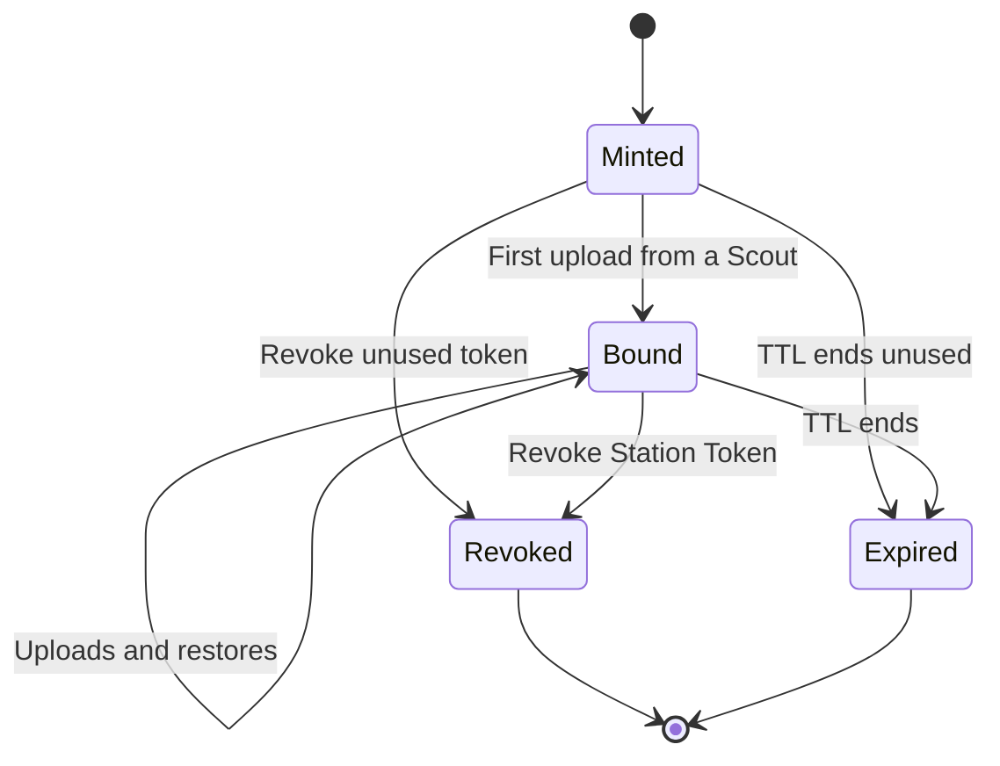

Scouts authenticate to Station with a signed Station token that Station mints. Station keeps a record of each token but never stores the raw token.

**You sign in to manage Station. An admin session lets you mint a Station token. Scout uses that token to upload and recover snapshots.**

Station checks your admin access through your sign-in session. See [API authentication](/station/api#authenticate) for how scripts sign in and check whether their session has admin access.

<Frame caption="Station mints a token, and Scout saves it in its settings.">
  
</Frame>

## Mint a token

<Steps>
  <Step title="Open the dialog">
    In Station, click **Mint Station Token**.
  </Step>
  <Step title="Choose options">
    - **TTL Days**: how long the token is valid, from 1 to 3650 days (default 365).
    - **Shared token**: leave off for one Scout. See [Shared tokens](#shared-tokens).
  </Step>
  <Step title="Mint and copy">
    Click **Mint Token**, then **Copy**.
  </Step>
  <Step title="Paste it into Scout">
    In Scout, open **Edit Scout Settings** and paste it into **Station Token**, then save.
  </Step>
</Steps>

<Warning>
  The token is shown **once**. Paste it into Scout before closing the dialog. If you lose it, mint another.
</Warning>

## How binding works

A normal token is **single-instance**: it binds to the first Scout installation that uploads with it, and Station rejects it from any other installation. The reservation is atomic, so concurrent first uploads cannot exceed the limit. Every chunk and finalize request must also use the token that owns its upload session.

## Shared tokens

To use one token on several machines, turn on **Shared token** and set **Shared Instance Limit** to the number of Scout installations allowed to use it (2 to 10000).

Each machine still gets its own instance ID, so their snapshots stay separate on Station.

## Revoke a token

Click **Revoke Station Token** on the Scout instance in Station's snapshot view. That Scout can no longer upload or restore. Snapshots already stored are **kept**, and you can still download them from Station's UI. Revoking a shared token stops **every** Scout using it.

<Note>
  Open **Mint Station Token → Issued Station Tokens** to revoke any issued token, including one that no Scout has used yet. The list shows its hash prefix, creation time, expiry, and sharing limit; it never reveals the original token.
</Note>

## Replace a token

Revoke the old token first, or wait for it to expire, because Station rejects a new one while the instance is still bound to a live token. The replacement binds on Scout's next upload, not when you save it.

## Delete a Scout instance

**Delete Instance** permanently deletes **all snapshots** for that instance and removes it from Station, along with the archive size history used for [unusual sizes](/station/snapshots#unusual-sizes). It can't be undone. If Station finds no backup files for an instance, it offers to remove the stale entry instead.

Deleting an instance doesn't revoke its token. Stop the Scout or revoke the token first if it must stop uploading.
